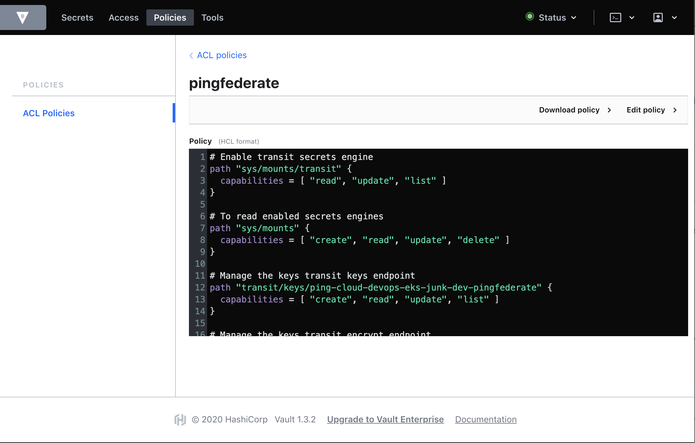

## Overview of Vault Deployment

This example will contain a vault deployment that you can use to demostrate an integration with PingFederate and PingAccess to manage their corresponding MasterKeys (pf.pwk and pa.pwk). In addition, you can utilize Hashicorp Vault to manage license files, devops keys, product secrets, etc.

To help demostrate integration with Hashicorp Vault, you can clone Hashicrop's Vault Helm chart to deploy a near-production environment to validate and manage Ping Identity product master keys, license files, devops keys, and various secrets.

 Illustrated below are the specific configuration items we are using for our demostration deployment. Additionally, we'll deploy Vault into Amazon Elastic Kubernetes Service (EKS) and using some of AWS's specific services ([AWS KMS](https://aws.amazon.com/kms/) and [AWS DynamoDB](https://aws.amazon.com/dynamodb/)) to help simplify the deployment architecture.


### Prerequisites

- [Helm](https://helm.sh/docs/intro/install/) - Hashicorp Vault uses Helm 3.
- Kubernetes 1.7
- OpenSSL or your favorite PKI tool.

### Enable TLS

Before you deploy Vault using Helm, add the tls keypair (public and private keys) and ca chain file as a kubernetes secret. The public certificate and private key should be seperate files. You can use openssl to quickly create a self-signed certificate or one issued/signed by your Certificate Authority. \

> Note: If using a self-signed certificate, the public certificate is also the CA certificate.

```sh
kubectl create secret generic vault-certstore \
--from-file=vault.key=<local_path_to_tls_key>/tls.key \
--from-file=vault.crt=<local_path_to_tls_cert>/tls.crt \
--from-file=vault.ca=<local_path_to_ca_cert>/vault.ca
```

To secure the Vault's endpoints update the following parameters in the [values.yaml](vault-helm/values.yaml) file:

##### global

Enable tls globally.

``` yaml
# TLS for end-to-end encrypted transport
tlsDisable: false
```

##### extraEnvironmentVars

The environment variable that will contain the path to the CA Certificate used for TLS.

```yaml
  # extraEnvironmentVars is a list of extra enviroment variables to set with the stateful set. These could be
  # used to include variables required for auto-unseal.
  extraEnvironmentVars:
    VAULT_CACERT: /vault/userconfig/vault-certstore/vault.ca
```

##### extraVolumes

The volume mount for the certificate store secret. This mount will contain the tls public certificate, private key and CA certificate.

```yaml
# extraVolumes is a list of extra volumes to mount. These will be exposed
# to Vault in the path `/vault/userconfig/<name>/`. The value below is
# an array of objects, examples are shown below.
extraVolumes:
- type: secret
  name: vault-certstore
```

##### ha

To enable TLS, navigate to the `ha` deployment section and add the following parameters to the `listener "tcp"` element:

```yaml
  # Run Vault in "HA" mode. There are no storage requirements unless audit log
  # persistence is required.  In HA mode Vault will configure itself to use Consul
  # for its storage backend.  The default configuration provided will work the Consul
  # Helm project by default.  It is possible to manually configure Vault to use a
  # different HA backend.
  ha:
    enabled: true
    replicas: 3

    # config is a raw string of default configuration when using a Stateful
    # deployment. Default is to use a Consul for its HA storage backend.
    # This should be HCL.
    config: |
      ui = true
      log_level = "Debug"

      listener "tcp" {
        tls_disable = 0
        address = "[::]:8200"
        cluster_address = "[::]:8201"
        tls_cert_file = "/vault/userconfig/vault-certstore/vault.crt"
        tls_key_file  = "/vault/userconfig/vault-certstore/vault.key"
        tls_client_ca_file = "/vault/userconfig/vault-certstore/vault.ca"
      }
```

### Storage Backend

As we are using AWS for our deployment example, we can take advantage of various AWS service to simplify our deployment architecture. The Hashicrop Vault Helm chart has examples for using file and/or an existing Hashicorp Consul deployment. For this example, we will be updating the high availability deployment to use AWS DynamoDB.

#### AWS DynamoDB

Create an AWS access key and secret with permissions to manage the dynamodb.

>Note: If the table does not exist in dynamodb, Vault will create it for you.

The permissions that the Vault IAM user requires to manage dynamodb can be found [here](https://www.vaultproject.io/docs/configuration/storage/dynamodb/#required-aws-permissions).

> Note: If you setup permissions specified at the link above, Vault will create the table if it does not already exist.

Check out [DynamoDB Storage Backend](https://www.vaultproject.io/docs/configuration/storage/dynamodb/) for additional parameters to use dynamodb as a storage mechanism.

Add your AWS access and secret key as a Kubernetes Secret

```
kubectl create secret generic dynamodb-access-secret-keys \
--from-literal=AWS_ACCESS_KEY_ID=<YOUR_AWS_ACCCESS_KEY> \
--from-literal=AWS_SECRET_ACCESS_KEY=<YOUR_AWS_ACCCESS_KEY_SECRET>
```

Kubernetes can provide the secrets as environment variables which Vault can use so you do not accidently expose your the secret outside of Kubernetes. Update the values.yaml file to include your AWS key and secret within the extraSecretEnvironmentVars section.

```yaml
  # extraSecretEnvironmentVars is a list of extra enviroment variables to set with the stateful set.
  # These variables take value from existing Secret objects.
  extraSecretEnvironmentVars:
  - envName: AWS_SECRET_ACCESS_KEY
    secretName: dynamodb-access-secret-key
    secretKey: AWS_SECRET_ACCESS_KEY
  - envName: AWS_ACCESS_KEY_ID
    secretName: dynamodb-access-secret-key
    secretKey: AWS_ACCESS_KEY_ID
```

Update the dynamodb storage element with your corresponding AWS region and dynamodb table name.

```yaml
      storage "dynamodb" {
        ha_enabled = "true"
        region = "<aws_region>"
        table = "<dynamodb_table_name>"
      }
```

### Auto Unseal

Since we like to keep things simple, we are using Vault's Auto Unseal AWS support.

#### AWS KMS

You will need to setup your existing AWS access key id and secret with the correct permissions. If you are using dynamodb for your backend storage, then add the permissions to your AWS access key.

See the Hashicorp's Vault [AWS KMS documentation](https://www.vaultproject.io/docs/configuration/seal/awskms/#authentication).

Vault can retrieve the AWS KMS Key ID via environment varaiable so it is not accidently exposed outside of the kubernetes environment.

Add the KMS Key as a Kubernetes Secret.

```
kubectl create secret generic aws-kms-key-id \
--from-literal=KMS_KEY_ID=<your_key_id>
```

Update the values.yaml file to include your AWS key and secret within the extraSecretEnvironmentVars section.

```yaml
  # extraSecretEnvironmentVars is a list of extra enviroment variables to set with the stateful set.
  # These variables take value from existing Secret objects.
  extraSecretEnvironmentVars:
  - envName: VAULT_AWSKMS_SEAL_KEY_ID
    secretName: aws-kms-key-id
    secretKey: KMS_KEY_ID
```

Add a seal element to the config map of your Vault deployment (standalone | ha). Update the region parameter with your AWS region value.

```yaml
      seal "awskms" {
        region      = "<aws_region>"
      }
```

### Deploy Vault Using Helm

1. Open your favorite terminal.
2. Navigate to the location where you cloned this repo.
3. Execute `helm install vault /.`

 ```
 NAME: vault
LAST DEPLOYED: Thu Mar 12 17:27:19 2020
NAMESPACE: ping-cloud-devops-eks
STATUS: deployed
REVISION: 1
TEST SUITE: None
NOTES:
Thank you for installing HashiCorp Vault!

Now that you have deployed Vault, you should look over the docs on using
Vault with Kubernetes available here:

https://www.vaultproject.io/docs/


Your release is named vault. To learn more about the release, try:

  $ helm status vault
  $ helm get vault
 ```

### Initialize the Vault

If this is the first time you deployed Vault within your environment it will need to be initialized.

```
kubectl exec vault-0 -- vault operator init
```

If the initialization is successful, you should receive the recovery keys and Initial Root token. Make sure you store those recovery keys and root token somewhere secure.

```
Recovery Key 1: <key_1>
Recovery Key 2: <key_2>
Recovery Key 3: <key_3>
Recovery Key 4: <key_4>
Recovery Key 5: <key_5>

Initial Root Token: <root_token>

Success! Vault is initialized

Recovery key initialized with 5 key shares and a key threshold of 3. Please
securely distribute the key shares printed above.
```

### Pod Authentication

In order for Ping Identity products and applications to take advantage of Vault, they must have a Vault client token to successully authenticate to Vault. For applications deployed in a kubernetes environment, we can use Vault's kubernetes auth method.

#### Kubernetes Auth Method

With this auth method enabled, Vault can use a pod's Kubernetes Service Account Token to authenticate and exchange for a Vault client token which is tied to a particular role in order to perform certain Vault operations. 

##### Get K8s Cluster Data

First, lets attach to our namespace where the Hashicorp vault will be deployed.

```
kubens ping-cloud-devops-eks-vault
```
The vault's cluster role binding creates a service account `vault` to perform delegated authentication and authorization checks. This service account is used by the kubernetes authentication mechanism to allow authentication by other applications.

Lets retrieve the service account secret name and set an environment variable: `SA_SECRET_NAME`. 

```
export SA_SECRET_NAME=$(kubectl get serviceaccounts vault -o jsonpath="{.secrets[].name}")
```

Save the service account CA certificate, kubernetes cluster API hostname, and the service account token to environment variables. These variable values will be used in the kerberos auth method configuration.

```
export SA_CA_CRT=$(kubectl get secret $SA_SECRET_NAME -o jsonpath="{.data['ca\.crt']}" | base64 --decode; echo)
```

```
export K8S_API_HOST=$(kubectl config view --minify -o jsonpath='{.clusters[0].cluster.server}')
```

```
export SA_TOKEN=$(kubectl get secret $SA_SECRET_NAME -o jsonpath="{.data['token']}" | base64 --decode; echo)
```

---> Diagram

##### Add Vault Policies

Add the pingfederate.hcl, pingaccess.hcl, and pingcentral.hcl policies to ensure the apps/products only have access to their secrets and keys.

There are 3 methods to add the policies to your Vault. Be sure to update the <namespace> and <env> tags in your policy files with the appropiate values. The recommended values for <namespace> is your k8s namespace and <env> : dev, staging, prod, etc

Example: 
  <namespace> : ping-cloud-eks-bob
  <env> : dev


CLI: Note, you will need to attach to a vault pod.
```
vault policy write <namespace>-<env>-pingfederate -<<
# Enable transit secrets engine
path "sys/mounts/transit" {
  capabilities = [ "read", "update", "list" ]
}

# To read enabled secrets engines
path "sys/mounts" {
  capabilities = [ "create", "read", "update", "delete" ]
}

# Manage the keys transit keys endpoint
path "transit/keys/<namespace>-<environment>-pingfederate" {
  capabilities = [ "create", "read", "update", "list" ]
}

# Manage the keys transit keys endpoint
path "transit/encrypt/<namespace>-<environment>-pingfederate" {
  capabilities = [ "create", "read", "update", "list" ]
}

# Manage the keys transit keys endpoint
path "transit/decrypt/<namespace>-<environment>-pingfederate" {
  capabilities = [ "create", "read", "update", "list" ]
}

#Manage the cubbyhole secrets engine
path "cubbyhole/<namespace>/<env>/pingfederate/masterkey" {
  capabilities = [ "create", "read", "update", "list" ]
}
EOF
```
API: Note, your client should be able to access the vault API endpoint.  
```
curl \
    --header "X-Vault-Token: ..." \
    --request PUT \
    --data @pingfederate-policy.hcl \
    http://127.0.0.1:8200/v1/sys/policy/<namespace>-<env>-pingfederate
```

Vault UI:



Remember to add the additional policies for PingAccess and PingCentral.


##### Configure Kubernetes Auth

The below commands can be performed by the Vault operator or configuration management tool. 

Enable kubernetes auth. It is important to note that Vault does not need to be deployed in a kubernetes environment to support kubernetes auth. In addition, you can support multiple kubernetes clusters. 

```
kubectl exec vault-0 -- vault auth enable kubernetes
```

Configure the kubernetes auth mechanism.

```
kubectl exec vault-0 -- vault write auth/kubernetes/config \
token_reviewer_jwt=$SA_TOKEN \
kubernetes_host=$K8S_API_HOST \
kubernetes_ca_cert=$SA_CA_CRT
```

Register a role for each application/product. To give you more control over the permissions that each application/product has, we are using the following naming convention for roles:

`<k8s-namespace>-<environment>-<product_name>`

```
Example: 
  k8s-namespace = ping-cloud-devops-eks-apps
  environment = dev
  product_name = pingfederate

  ping-cloud-devops-eks-apps-dev-pingfederate
```

Update the below command with your role name, application namespace, and policy name before executing.

```
kubectl exec vault-0 -- vault write auth/kubernetes/role/<namespace>-<environment>-<product_name> \
        bound_service_account_names=vault-auth \
        bound_service_account_namespaces=<application_namespace> \
        policies=<policy> 
```

##### Transit Secret Engine

The Transit secret engine uses a Vault managed key to support encryption and decryption of the product's (PingFederate, PingAccess, and PingCentral) master key. Each product implements a common interface (MasterKeyEncryptor) that will encrypt the masterkey while at rest.

##### CubbyHole Secret Engine

The CubbyHole secret engine is used to store the master key for each product. This is to assist backups and restoration. In addition could be used to assist with migrating configs from one environment to another (Example: Development to Staging). 
