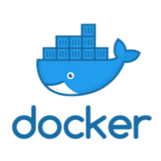
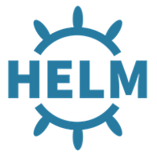

# Welcome

This documentation exists to enable DevOps professionals, administrators, and developers to deploy Ping Identity software using container technologies. Our goal is to provide tools, frameworks, blueprints, and reference architectures in support of running our products in containerized environments.

New to Kubernetes? See [Kubernetes Basics](./reference/k8sBasics.md)

New to Helm?  See [Helm Basics](./reference/HelmBasics.md)

First time here?  We recommend the [Get Started](./get-started/introduction.md) page.

## Benefits from this program

* **Streamlined Deployments**

    Deploy and run workloads on our solutions without the need for additional hardware or virtual machines (VMs).

* **Consistent and Flexible**

    Maintain all configurations and dependencies, ensuring consistent environments. Containers are portable and can be used on nearly any machine.

* **Optimized Sizing**

    Orchestration of containers allows organizations to increase fault tolerance and availability and to better manage costs by auto-scaling to application demand.

## Resources

Resources provided include Docker images of Ping Identity products, deployment examples, and configuration management tools.

###  Docker Images

    
    
        <a class="assetlinks" href="https://hub.docker.com/u/pingidentity" target=”_blank”>Docker Images</a>
    

    
    
        <a class="assetlinks" href="https://github.com/pingidentity/pingidentity-docker-builds" target=”_blank”>Docker Builds</a>
    

Ping provides preconfigured Docker images of our products for running as containers. Each of our containers is a complete working product instance that is immediately usable when deployed. Our Docker stacks are integrated collections of Ping products preconfigured to coordinate across all containers in the stack.

!!! info "By default, our Docker images run as an unprivileged user in the container."

You can find information about our available Docker images in the [pingidentity-docker-builds](https://github.com/pingidentity/pingidentity-docker-builds) repository on Github or on the [Docker Hub](https://hub.docker.com/u/pingidentity/) site.  Included in this portal are detailed [image specifications](./docker-images/dockerImagesRef.md) on variables, related images and so on.

The Docker images are automatically pulled from our repository the first time you deploy a product container or orchestrated set of containers. Alternatively, you can pull the images manually from our [Docker Hub](https://hub.docker.com/u/pingidentity/) site.

### Deployment Examples

    
    
        <a class="assetlinks" href="https://github.com/pingidentity/pingidentity-devops-getting-started" target=”_blank”>DevOps Getting Started</a>
    

The Github repository linked here provides examples for deploying our products as standalone containers, in a Docker Compose stack, or as an orchestrated deployment in Kubernetes (using Helm).

Docker Compose is often used for development, demonstrations, and lightweight orchestration. Kubernetes is typically used for enterprise-level orchestration.

### Configuration Management

For configuration management, we use:

- Server profiles, for runtime configuration of containers.
- YAML files for runtime configuration of stacks. YAML file configuration settings complement those provided through server profiles.
- Environment variables. These can be included in YAML files or called from external files.
- Shell scripts (hooks) to automate certain operations for a product.
- Release tags to give you a choice between stable builds or the current (potentially unstable) builds.

More information about how server profiles, variables and these other options coordinate to configure the products can be found on the [Configuration Reference](./reference/config.md) page.

## Other Resources

    
    
        <a class="assetlinks" href="https://github.com/topics/ping-devops" target=”_blank”>All Ping DevOps Github Repos</a>
    

    
    
        <a class="assetlinks" href="https://helm.pingidentity.com" target=”_blank”>Ping Helm Charts</a>
    

