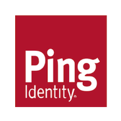

# Ping Identity DevOps

We enable DevOps professionals, administrators and developers with tools, frameworks, blueprints and reference architectures to deploy Ping Identity software in the cloud.

## DevOps Resources

    
    
        <a class="assetlinks" href="https://hub.docker.com/u/pingidentity" target=”_blank”>Docker Images</a>
    

    
    
        <a class="assetlinks" href="https://github.com/topics/ping-devops" target=”_blank”>Github Repos</a>
    

    
    
        <a class="assetlinks" href="https://helm.pingidentity.com" target=”_blank”>Helm Charts</a>
    

    
    
        <a class="assetlinks" href="https://support.pingidentity.com/s/topic/0TO1W000000IF30WAG/cloud-devops" target=”_blank”>Community</a>
    

## Benefits of DevOps

* **Streamlined Deployments**

    Deploy and run workloads on our solutions without the need for additional hardware or VMs.

* **Consistent and Flexible**

    Maintain all configurations and dependencies, ensuring consistent environments. Containers are portable and can be used on nearly any machine.

* **Optimized Sizing**

    Orchestration of containers allows organizations to increase fault tolerance, availability, and better manage costs by auto-scaling to application demand.

## Overview

See [Overview](overview.md) for descriptions of the components of our DevOps architecture and repositories.

## Get Started

See [Get Started](get-started/getStarted.md) to quickly deploy a preconfigured DevOps image of a Ping Identity solution or integrated set of solutions.

## Contact Us

If you find functionality missing that you believe may be of benefit to other Ping Identity customers:

* Log a [GitHub Issue](https://github.com/pingidentity/pingidentity-devops-getting-started/issues)
* Ask a question on our [Cloud DevOps Community](https://support.pingidentity.com/s/topic/0TO1W000000IF8fWAG/cloud-devops-community)
* Create a Ping Identity [Support Case](https://support.pingidentity.com/s/)
