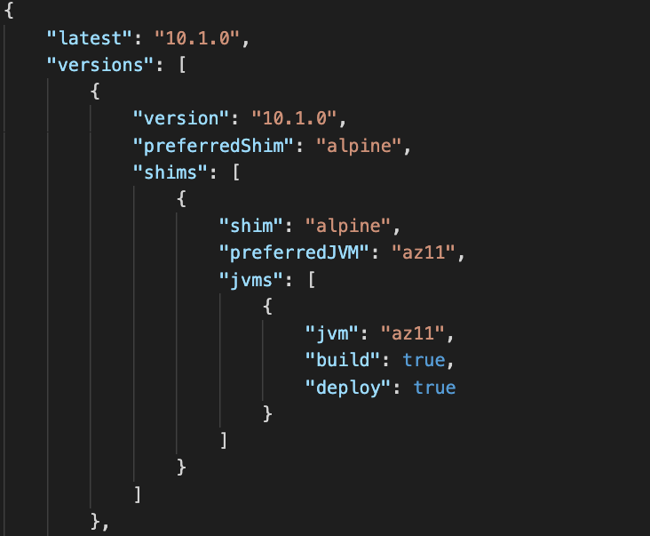
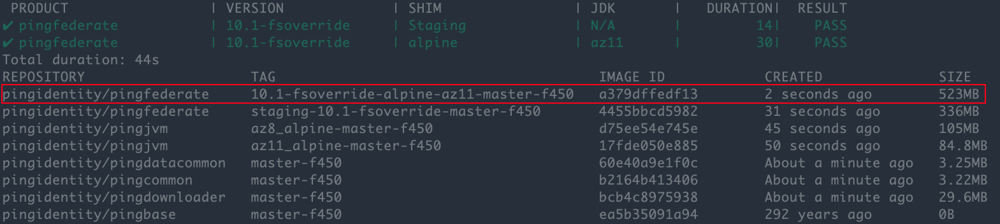
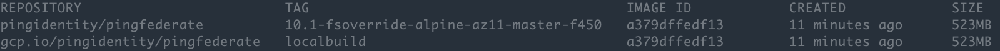

# Build Docker Image with Local Zip File

In this document, we'll cover how to build a Docker Image using the build tools found in Ping Identity's [Docker Builds](https://github.com/pingidentity/pingidentity-docker-builds) repo and a local copy of a product zip file.

## Clone the Docker Builds Repository

From you terminal

```sh
git clone https://github.com/pingidentity/pingidentity-docker-builds.git
```

## Download Product Artifact
Navigate to [Product Downloads](https://www.pingidentity.com/en/resources/downloads.html) and download the product you wish to build a Docker Image for.

> Note: Be sure to download the Product Distribution and not the Windows Installer.

Once you have the zip file downloaded, rename it to product.zip

```sh
mv pingfederate-10.1.0.zip product.zip
```

## Move product.zip to Build Folder

Within the docker-builds repo, there is a folder for each product. Move the product.zip file inside the product/tmp folder

Example

```sh
 mv ~/Downloads/product.zip \
    ~/pingidentity/devops/pingidentity-docker-builds/pingfederate/tmp
 ```

## Building the Docker Image

Prior to building the image, view the verions.json file in the product folder as you'll need to specify a valid version for the build script. Since you're providing the product zip file, it doesn't really matter which one you select as long as it's valid.

Using **PingFederate** as an example, you can see that `10.1.0` is a valid product version.



In your terminal, navigate to the base of the `docker-builds` repo.

Example

```sh
cd ~/pingidentity/devops/pingidentity/docker-builds
```

Ping Identity Docker Images are built using common foundational layers (JVM, pingcommon, pingdatacommon etc) that the product layer will need. Since you most likely don't have the layers locally we will build the product using the `serial_build.sh` script. Going forward if you wish to use the same foundational layers, you can run the `build_product.sh` script to simply build the top layer.

To build the PingFederate image we'll specify the following options to build_serial

* -p (Product): pingfederate
* -v (Version): 10.1.0
  * Note: this is the version retrieved from the **versions.json** file
* -s (Shim): alpine
* -j (Java): az11

Run the following command to build the image

```sh
./ci_scripts/serial_build.sh \
    -p pingfederate \
    -v 10.1 \
    -s alpine \
    -j az11
```
> Note: It is important to build from the base of the repo as shown in the above command.

Once completed, you should see the product and base images



## Retagging Local Image

If you wish to change the tag of the create image and push to your own registry, use the following command.

Command Syntax

```sh
docker tag [image id] \
    [Docker Registry]/[Organization]/[Image Name]:[tag]
```

Example

```sh
 docker tag a379dffedf13 \
 gcp.io/pingidentity/pingfederate:localbuild
```



