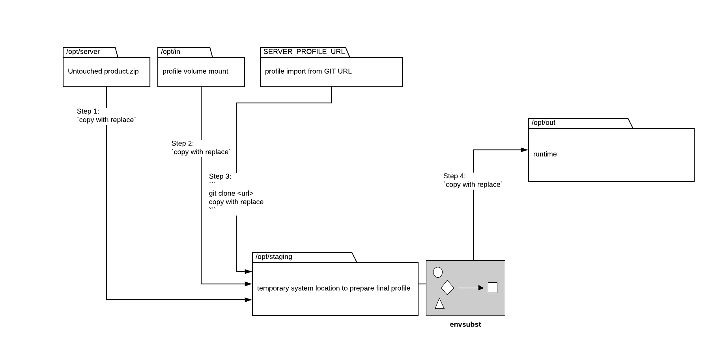

# Anatomy of a Ping Container

Any configuration that is deployed with a pingidentity container can be considered a 'profile'. A profile typically looks like a set of files. These files can be built into the image, mounted in to the image, or pulled at startup(recommend).

Because profiles can get into PingIdentity containers in a variety of ways, it is important to understand the file structure within the container and how they are moved around.

This is explained in two diagrams:
1. Generic container startup
2. How the directories overlay each other

Directories in the diagram:
**/opt/server** - This is always a fresh, untouched, unzip of the software version of the product.
**/opt/in** - Any profile that you want to mount-in to the container should be placed here. 
**SERVER_PROFILE_URL** - A git clone of a profile from a repository. Note, the profile is cloned to /tmp/staging then moved to /opt/staging/
**opt/staging** where the above locations move to and are evaluated for variables before moving to /opt/out
**opt/out** - the final, runtime location for all files. This is the directory to persist if you want to treat a container like a VM.

This diagram shows how the directories can work together. In this example we see: 
1. A common pattern where the PingFederate license is mounted in as a file so it is not stored in a repository. This mount could be a volume-mount or it could be placed in to the image directly with a separate Dockerfile. This is also an acceptable approach for custom extensions and .jars
2. Any additional files that are relevant to _customizing_ this PingFederate configuration are pulled from a git repository so that they can be tracked with version control. 
3. Everything else needed for the server to run is filled in with the standard PingFederate bits automatically.

Futher details of customizing deployments with profiles: [Customizing server profiles](profiles.md)