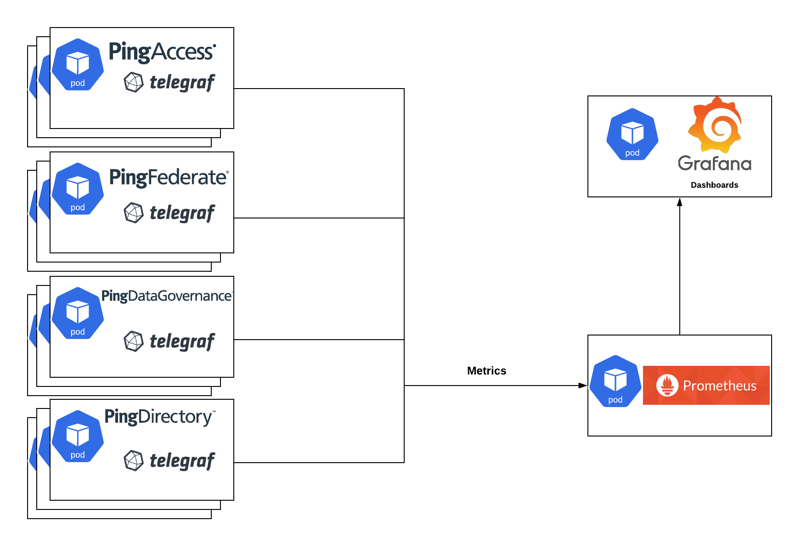
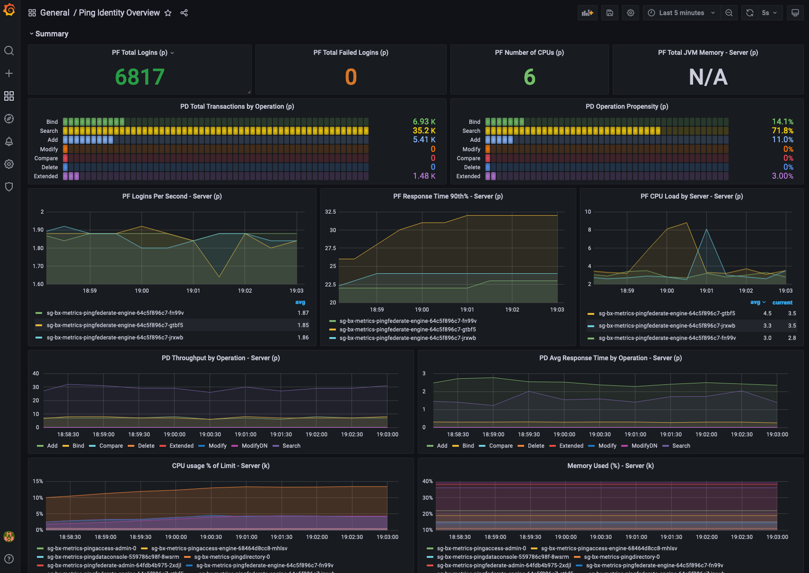

# Deploy a Kubernetes Cluster Metrics Stack



This document covers deploying and using a sample open-source monitoring stack in a Kubernetes cluster. The resulting environment should not be considered production-ready.  It is meant to show how quickly Ping DevOps software can produce metrics for consumption by a popular open-source monitoring system. This example metrics stack is not maintained or directly supported by Ping.

!!! error "Kubernetes version notice"
    The *Prometheus operator* used for this example is incompatible with Kubernetes v1.25 or later due to the removal of the deprecated [PodSecurityPolicy](https://kubernetes.io/docs/concepts/security/pod-security-policy/) object with that release.  As of September 2022, the operator only supports up through Kubernetes v1.24.  Until this is updated, your Kubernetes cluster must be V1.24 or lower to follow the example on this page.

    See the compatibility chart at the [Prometheus operator](https://github.com/prometheus-operator/kube-prometheus) repository for more information.
## Stack Components

**Open Source Tools**

- [kube-prometheus-stack](https://github.com/prometheus-community/helm-charts/tree/main/charts/kube-prometheus-stack) - _includes_:
  - [Prometheus](https://prometheus.io/) - Metrics collection and storage.
  - [Grafana](https://grafana.com/) - Metrics visualization in Dashboards.
- [telegraf-operator](https://github.com/influxdata/helm-charts/tree/master/charts/telegraf-operator) - Metrics exposure and formatting.

**Grafana Dashboard** - JSON file to import for dashboard definition.

**ping-devops values.yaml** - values relevant only to exposing metrics for Ping Identity software.

## Prerequisites

It is assumed you are familiar with the prerequisites for the base Helm examples.  Beyond that, any knowledge of Prometheus, Grafana, and Telegraf is helpful.

## Deploy the Stack

In the `pingidentity-devops-getting-started/30-helm/cluster-metrics directory` of this repository, edit the `01-prometheus-values.yaml` as needed. This file provides configurations beyond the default kube-prometheus-stack. In this sample deployment, the monitoring stack is granted read access to the entire cluster and is deployed into the `metrics` namespace. 

!!! error "Not for production use"
    Changing these settings or making the deployment production-ready is beyond scope of this document. The full set of optional values can be found on the Github repository for the Prometheus chart.

There are numerous lines that have `##CHANGEME`. These lines should be considered for configuration options to meet your needs.

After updating the file, deploy the `kube-prometheus-stack`.  The path to the configuration file assumes you are in the root folder of the local repository copy:

```
kubectl create namespace metrics

helm upgrade --install metrics --repo https://prometheus-community.github.io/helm-charts kube-prometheus-stack -n metrics --version 30.0.1 -f 30-helm/cluster-metrics/01-prometheus-values.yaml

```

Deploy `telegraf-operator`:

```
helm upgrade --install telegraf --repo https://helm.influxdata.com/ telegraf-operator -n metrics --version 1.3.3 -f 30-helm/cluster-metrics/02-telegraf-values.yaml
```

Telegraf operator makes it very easy to add monitoring sidecars to your deployments. All you need to do is add annotations, which are shown in `30-helm/cluster-metrics/03-ping-with-metrics-values.yaml`

These values can be copied to your ping-devops `values.yaml` manually, or the file can be referenced at the end of your helm install command. For example:

```
helm upgrade --install ping-metrics pingidentity/ping-devops -f my-values.yaml -f 30-helm/cluster-metrics/03-ping-with-metrics-values.yaml
```

After the Ping software is healthy and producing metrics, there should be sidecars on Ping pods.

```
NAME                                                 READY   STATUS
ping-metrics-pingaccess-admin-0                      1/1     Running
ping-metrics-pingaccess-engine-68464d8cc8-mhlsv      2/2     Running
ping-metrics-pingdataconsole-559786c98f-8wsrm        1/1     Running
ping-metrics-pingdirectory-0                         2/2     Running
ping-metrics-pingfederate-admin-64fdb4b975-2xdjl     1/1     Running
ping-metrics-pingfederate-engine-64c5f896c7-fn99v    2/2     Running
```

Note the `2/2` indicator for pods with sidecars.

## View Metrics

Browse to Grafana using the Ingress URL or by running a `kubectl port-forward` command.  For example: `kubectl port-forward svc/metrics-grafana --namespace metrics 9000:80`
In your browser, navigate to `http://localhost:9000` and log in with the user `admin` and the password set in `01-prometheus-values.yaml`

Finally, import the `04-ping-overview-dashboard.json` using the `+` button on the left of Grafana's home screen.

The `Ping Identity Overview` dashboard will have a dropdown for namespace at the top. Select the namespace running Ping products to see something similar to this example:



Any of the panels can be edited, or new ones created to fit your needs.
