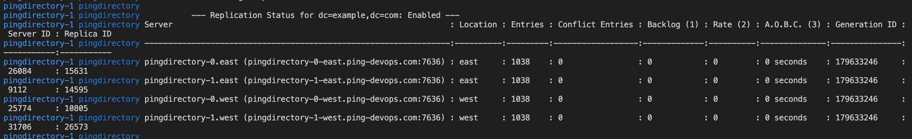

# PingDirectory Deployments Across Kubernetes Clusters

The following example is an extension of the topic *Orchestrating a replicated PingDirectory deployment* in [Kubernetes orchestration for general use](deployK8sGeneral.md). In this example, you'll deploy PingDirectory containers across multiple Kubernetes clusters.


## Overview

Having a replicated PingDirectory topology across multiple kubernetes clusters is desired for highly-available active/active deployments as well as active/partial-active scenarios where a hot backup is expected.

Ping Identity PingDirectory Docker images abstract away much of the complexity of replication initialization scripts, even across clusters. Instead, the focus is on
providing accessible DNS hostnames across clusters and environment variables to build ordinal hostnames for each Directory instance.

### About PingDirectory clusters

You will need the following:

1. [PingDirectory Container Keys To Success](#pingdirectory-host-naming).
1. [Draft Hostnames](#variables-to-create-hostnames) - Determine the variables needed to create your hostnames.
1. [Additional Variables](#environment-variables) - Use these variables for use-case flexibility.
1. [Cluster Startup Background](#cluster-startup-walkthrough) - Walk through what happens when a cluster starts.
1. [Design Infrastructure to Match Hostnames](#reference-modes-of-deployment) - Based on your infrastructure constraints, you might need to alter your hostname plans. Use these reference examples to help.
1. `11-replication-timing` - Use this folder to test replication speeds in the deployment.

Because details within each Kubernetes cluster are well-hidden from outside the cluster, external access to each pod within the cluster is required. The PingDirectory images set up access to each of the pods using load balancers from an external host to allow each pod to communicate over the LDAP and replication protocols.

## PingDirectory Host Naming

The most important aspect of a successful PingDirectory cross-cluster deployment assigning accessible and logical DNS hostnames according to the following rules:

1. Each PingDirectory needs its own hostname available in DNS.
1. The hostname has a space for the ordinal representing the instance in the `statefulset`.
1. All hostnames are accessible to all directory instances.

These rules still leave plenty of room for flexibility, especially when accounting for cluster-native DNS names Kubernetes creates.

### Single-Cluster Multiple-Namespace

If you were to simulate a "multi-cluster" environment in a single cluster, you could just set up two namespaces and create a separate ClusterIP service for each directory, as follows:

#### Primary Cluster

| Pod | Service Name | Namespace | Hostname
|-----|-----|-----|-----|
|pindirectory-0 | pingdirectory-0 | primary | pingdirectory-0.primary|
|pindirectory-1 | pingdirectory-1 | primary | pingdirectory-1.primary|
|pindirectory-2 | pingdirectory-2 | primary | pingdirectory-2.primary|

#### Secondary Cluster

| Pod | Service Name | Namespace | Hostname
|-----|-----|-----|-----|
|pindirectory-0 | pingdirectory-0 | secondary | pingdirectory-0.secondary|
|pindirectory-1 | pingdirectory-1 | secondary | pingdirectory-1.secondary|
|pindirectory-2 | pingdirectory-2 | secondary | pingdirectory-2.secondary|

### External DNS Names

In a Prod Environment with external hostnames, it might look more like:

#### us-west cluster

| Pod | Service Name | DNS / Hostname
|-----|-----|-----|
|pindirectory-0 | pingdirectory-0 | pingdirectory-0-us-west.ping-devops.com|
|pindirectory-1 | pingdirectory-1 | pingdirectory-1-us-west.ping-devops.com|
|pindirectory-2 | pingdirectory-2 | pingdirectory-2-us-west.ping-devops.com|

#### us-east cluster

| Pod | Service Name | DNS / Hostname
|-----|-----|-----|
|pindirectory-0 | pingdirectory-0 | pingdirectory-0-us-east.ping-devops.com|
|pindirectory-1 | pingdirectory-1 | pingdirectory-1-us-east.ping-devops.com|
|pindirectory-2 | pingdirectory-2 | pingdirectory-2-us-east.ping-devops.com|

## Variables to Create Hostnames

To provide flexibility on how PingDirectory finds other instances, a full DNS hostname is broken into multiple variables.

| Variable | Description |
|---|---|
| `K8S_POD_HOSTNAME_PREFIX` | The string used as the prefix for all host names.  Defaults to name of `StatefulSet`. |
| `K8S_POD_HOSTNAME_SUFFIX` | The string used as the suffix for all pod host names.  Defaults to `K8S_CLUSTER`. |
| `K8S_SEED_HOSTNAME_PREFIX` | The string used as the prefix for all seed host names.  Defaults to `K8S_POD_HOSTNAME_PREFIX`. |
| `K8S_SEED_HOSTNAME_SUFFIX` | The string used as the suffix for all seed host names.  Defaults to `K8S_SEED_CLUSTER` (discussed later). |

A full hostname is created using the following command:

```shell
${K8S_POD_HOSTNAME_PREFIX}<instance-ordinal>${K8S_SEED_HOSTNAME_SUFFIX}
```

### Using Previous Hostname Examples

| hostname | K8S_POD_HOSTNAME_PREFIX | K8S_SEED_HOSTNAME_PREFIX | K8S_POD_HOSTNAME_SUFFIX | K8S_SEED_HOSTNAME_SUFFIX |
|---|:---:|---|---|
| pingdirectory-0.primary|`pingdirectory-`| `pingdirectory-`| `.primary`|`.primary`|
| pingdirectory-2-us-west.ping-devops.com| `pingdirectory-`| `pingdirectory-`| `-us-west.ping-devops.com`|`-us-west.ping-devops.com`|


## Environment Variables

| Variable | Required | Description |
|---|:---:|---|
| `K8S_CLUSTERS` | *** | The total list of Kubernetes clusters that the `StatefulSet` replicates to. |
| `K8S_CLUSTER` | *** | The Kubernetes cluster the `StatefulSet` is deployed to. |
| `K8S_SEED_CLUSTER` | *** | The Kubernetes cluster that the seed server is deployed to. |
| `K8S_NUM_REPLICAS` |     | The number of replicas that make up the `StatefulSet`. |
| `K8S_POD_HOSTNAME_PREFIX` |     | The string used as the prefix for all host names.  Defaults to `StatefulSet`. |
| `K8S_POD_HOSTNAME_SUFFIX` |     | The string used as the suffix for all pod host names.  Defaults to `K8S_CLUSTER`. |
| `K8S_SEED_HOSTNAME_PREFIX` |     | The string used as the prefix for all seed host names.  Defaults to `K8S_POD_HOSTNAME_PREFIX`. |
| `K8S_SEED_HOSTNAME_SUFFIX` |     | The string used as the suffix for all seed host names.  Defaults to `K8S_SEED_CLUSTER`. |
| `K8S_INCREMENT_PORTS` |     | `true` or `false`.  If `true`, each pod's port will be incremented by 1. |

An example of the YAML configuration for these environment variables:

```yaml
K8S_STATEFUL_SET_NAME=pingdirectory
K8S_STATEFUL_SET_SERVICE_NAME=pingdirectory

K8S_CLUSTERS=us-east-2 eu-west-1
K8S_CLUSTER=us-east-2
K8S_SEED_CLUSTER=us-east-2
K8S_NUM_REPLICAS=3

K8S_POD_HOSTNAME_PREFIX=pd-
K8S_POD_HOSTNAME_SUFFIX=.us-cluster.ping-devops.com
K8S_SEED_HOSTNAME_PREFIX=pd-
K8S_SEED_HOSTNAME_SUFFIX=.us-cluster.ping-devops.com

K8S_INCREMENT_PORTS=true
LDAPS_PORT=8600
REPLICATION_PORT=8700
```

These environment variable settings would map out as follows:

| Seed | Pod | Instance | Host name | LDAP | REPL |
| :---: | :---: | --- | --- | :---: | :---: |
|      |     | CLUSTER: us-east-2
| ***  | *** | pingdirectory-0.us-east-2 | pd-0.us-cluster.ping-devops.com | 8600  | 8700 |
|      |     | pingdirectory-1.us-east-2 | pd-1.us-cluster.ping-devops.com | 8601  | 8701 |
|      |     | pingdirectory-2.us-east-2 | pd-2.us-cluster.ping-devops.com | 8602  | 8702 |
|      |     | CLUSTER: eu-west-1
|      |     | pingdirectory-0.eu-west-1 | pd-0.eu-cluster.ping-devops.com | 8600  | 8700 |
|      |     | pingdirectory-1.eu-west-1 | pd-1.eu-cluster.ping-devops.com | 8601  | 8701 |
|      |     | pingdirectory-2.eu-west-1 | pd-2.eu-cluster.ping-devops.com | 8602  | 8702 |

## Cluster Startup Walkthrough

This in-depth variable conversation offers the flexibility to accommodate various infrastructure constraints. For example, in some environments, you can't use the same port for each instance, so we must accommodate incrementing ports.

To understand why the initial creation of a cluster requires a prescriptive approach, it's helpful to know what happens when a cluster starts.

1. The first pod must start on its own and become healthy. This is critical to prevent replication islands. The first time the first pod starts, we call it "GENESIS". All other pods are dependent on this `SEED_POD` in the `SEED_CLUSTER` starting correctly on its own. The entire purpose of defining `SEED_POD` and `SEED_CLUSTER` variables is to avoid multiple genesis scenarios.

> Because we're deploying a `statefulset`, you can deploy the entire first cluster at once. A `statefulset` creates one pod in the number of replicas at a time.

1. When the first pod is healthy, it begins DNS querying combinations of hostnames at their LDAPS port to find another Directory instance.

In our first cluster, this would be the hostname of `pingdirectory-1`. but it could also be `pingdirectory-0` of another cluster. When the query returns successful, creation of the replication topology automatically begins.

1. From this point onward, the order in which instances start is less important.


### Note on Replication Traffic

It might not always be clear what truly happens during "replication". Though it is partially proprietary, you can think of it as:

1. A modify request arrives at one pod.

1. The corresponding Directory instance, say `pingdirectory-0`, makes the change locally and tracks the change in the changelog.

1. The instance broadcasts the change out to all other instances with the time of change. This request is added to a message queue of sorts on the other instances and processed in order.

Because of this, horizontal scaling of directories isn't something to be taken lightly.

## Reference Modes of Deployment

There are multiple types of deployments that have been tested because of various infrastructure constraints discussed in this guide. The example files in `09-multi-k8s-pingdirectory` show that the biggest key is having a way to provide an accessible hostname to all the other pods. In most examples, you do this by creating a service name and using `statefulset.kubernetes.io/pod-name` as the selector to isolate one pod.

### Multi-cluster Simulations

These are examples for demo environments to get a feel for what a multi-region deployment looks like.

#### Single Namespace

`20-kustomize/09-multi-k8s-pingdirectory/01-single-namespace` is the least constrained example. It's good to just see what logs on a cross-cluster topology look like:

* Relies only on DNS names that kubernetes provides.
* All traffic is in one namespace, so it should have no network constraints.


```sh
kubectl apply -f 01-west.yaml
```

1. Wait for `pingdirectory-0` to be healthy.

   ```sh
   kubectl apply -f 02-east.yaml
   ```

> Note, logs with [stern](https://github.com/wercker/stern) look better.
 `brew install stern`

2. Watch the logs.

    ```sh
    stern pingdirectory
    ```

   or

   ```sh
   kubectl logs -f -l role=pingdirectory
    ```

When the all the instances are up and running, you should see something similar to:


#### Single Cluster Multiple Namespaces

`20-kustomize/09-multi-k8s-pingdirectory/02-single-cluster-two-namespaces`

1. Use this example when you only have one cluster available for testing.

    The files in this example are templates and expect namespaces to be added.

    ```sh
    export NAMESPACE_1=<west-namespace>
    export NAMESPACE_2=<east-namespace>
    envsubst < 03-multi-cluster-dns/01-west.yaml | kubectl apply -f -
    envsubst < 03-multi-cluster-dns/02-east.yaml | kubectl apply -f -
    ```

2. Watch logs.

### VPC Peered K8s Clusters

These example should be possible in most Kubernetes providers as long as you can:

* Give external dns names to clusterIP services.
* Have replication and ldaps ports peered (open) between clusters.

Consider the [EKS Peering Config](./deployK8s-AWS.md) example if you want to test this.

#### Using External DNS Names


`20-kustomize/09-multi-k8s-pingdirectory/03-multi-cluster-dns`

This example uses [Headless Services](https://kubernetes.io/docs/concepts/services-networking/service/#headless-services) instead of regular clusterIp services. This is necessary in a VPC-peered environment because typically the route-tables and IP ranges you've peered correspond to container IP addresses, not service addresses.

If you were to use clusterIp addresses, the instances might, unexpectedly, not have network connectivity to each other.

The headless services use externalDNS to dynamically add records to the DNS provider (example, Route53)

Because this example requires more care, you should sift through the yamls to understand what is going on.

When the example is stood up, you'll see logs similar to:



### Without VPC Peering

Some organizations don't allow VPC peering or similar networking functions, or there might be no way to create external hostnames on clusterIp services. Here are some examples that may help.

#### Using NodePorts

In a scenario where you don't have VPC peering or must create external DNS names manually, it might be beneficial to use NodePorts.

To use NodePorts:

1. Use the `20-kustomize/09-multi-k8s-pingdirectory/03-multi-cluster-dns` example as reference
2. Make the pod-selector services NodePort services instead of clusterIp.
3. Optionally, remove the external name and create a routable dns name.

   If these names are being manually, then create the services and assign names before starting the statefulset.

### Single Load Balancer

!!! caution
    The following examples are for extremely constrained environments where traffic must go out through an external load balancer. For many purposes, these can be considered deprecated. Avoid doing replication through load balancers when possible.

The following diagram shows how you can use a single load balancer.


Advantages:

* Decreased cost of a single load balancer
* Single IP required
* Easier DNS management
    * Wildcard DNS domain
    * Or separate hosts pointing to load balancer

Disadvantages:

* More port mapping requirements
* Many external ports to manage and track

### Multiple Load Balancers

The following diagram shows how you can use muliple load balancers.


Advantages:

* Use the same well-known port, such as 1636/8989
* Separate IP addresses per instance

 Disadvantages:

* DNS management
    * Separate hostname required per instance

## `StatefulSet` Pod Services

The `StatefulSet` service manages stateful objects for each pod.

The following is an example `StatefulSet` service configuration for one pod:

```yaml
kind: Service
apiVersion: v1
metadata:
  name: pingdirectory-0-service
spec:
  type: ClusterIP
  selector:
    statefulset.kubernetes.io/pod-name: pingdirectory-0
  ports:
    - protocol: TCP
      port: 8600
      targetPort: 8600
      name: ldaps
    - protocol: TCP
      port: 8700
      targetPort: 8700
      name: repl
```

## Additional Kubernetes Resources Required

In addition to the `StatefulSet`, other resources are required to properly map the load balancers to the
pods. The following diagram shows each of those resources.


### DNS

A DNS entry is required at the load balancer to direct a wildcard domain or individual hostname
to the load balancer created by the NGINX Ingress Service or Controller.  For AWS, this can simply be an `A record` alias for each host or a wildcard `A record` for any host in that domain.

### NGINX Ingress Service and Controller

Several components map the ports from the external load balancer through the NGINX Service and Controller:

* External load balancer

  Provides an external IP and obtains definitions from the NGINX Ingress Service.

* NGINX Ingress Service

  Maps all port ranges (SEED_LDAPS_PORT, SEED_REPLICATION_PORT) to the same target port range.

* NGINX Ingress Controller

  Maps all port ranges to stateful set pods.

!!! warning
    Typically, the NGINX Service and TCP services require additional namespace access, `ingress-nginx-public`. Any additional applications using this service or controller generally requires additional privileges to manage this resource. For more information, see the *NGINX TCP services* topic.

The following is an example NGINX Service configuration:

```yaml
kind: Service
apiVersion: v1
metadata:
  name: ingress-nginx
  labels:
    app.kubernetes.io/name: ingress-nginx
    app.kubernetes.io/part-of: ingress-nginx
    app.kubernetes.io/role: ingress-nginx-public
  namespace: ingress-nginx-public
  annotations:
    service.beta.kubernetes.io/aws-load-balancer-type: nlb
spec:
  selector:
    app.kubernetes.io/name: ingress-nginx
    app.kubernetes.io/part-of: ingress-nginx
    app.kubernetes.io/role: ingress-nginx-public
  externalTrafficPolicy: Local
  type: load-balancer
  ports:
    - name: http
      port: 80
      targetPort: http
    - name: https
      port: 1443
      targetPort: https
    - name: ldaps-pingdiretory-0
      port: 8600
      targetPort: 8600
    - name: ldaps-pingdiretory-1
      port: 8601
      targetPort: 8601
    - name: ldaps-pingdiretory-2
      port: 8602
      targetPort: 8602
    - name: repl-pingdiretory-0
      port: 8700
      targetPort: 8700
    - name: repl-pingdiretory-1
      port: 8701
      targetPort: 8701
    - name: repl-pingdiretory-2
      port: 8702
      targetPort: 8702
```

### NGINX TCP Services

The ConfigMap for TCP services (`tcp-services`) provides the mappings from the target ports on the NGINX Controller to the associated pod service.

> You must replace the variable `${PING_IDENTITY_K8S_NAMESPACE}` with the namespace that your `StatefulSet` and Services are deployed into.

The following is an example of the ConfigMap for the NGINX TCP services configuration:

```yaml
apiVersion: v1
kind: ConfigMap
metadata:
  name: tcp-services
  namespace: ingress-nginx-public
  labels:
    app.kubernetes.io/name: ingress-nginx
    app.kubernetes.io/part-of: ingress-nginx
    app.kubernetes.io/role: ingress-nginx-public
data:
  8600: "${PING_IDENTITY_K8S_NAMESPACE}/pingdirectory-0-service:8600"
  8601: "${PING_IDENTITY_K8S_NAMESPACE}/pingdirectory-1-service:8601"
  8602: "${PING_IDENTITY_K8S_NAMESPACE}/pingdirectory-2-service:8602"
  8700: "${PING_IDENTITY_K8S_NAMESPACE}/pingdirectory-0-service:8700"
  8701: "${PING_IDENTITY_K8S_NAMESPACE}/pingdirectory-1-service:8701"
  8702: "${PING_IDENTITY_K8S_NAMESPACE}/pingdirectory-2-service:8702"
```

## Deployment Example

The examples in `20-kustomize/05-multi-k8s-cluster-pingdirectory` create an
example deployment across two clusters in AWS EKS:

* us-east-2 (SEED Cluster)
* eu-west-1

Deploy the NGINX services and ConfigMap for the example.

   This allows the services to be reached by the NGINX controller with an AWS Network Load Balancer (nlb).  You must run these with an AWS/Kubernetes profile allowing for application into the `ingress-nginx-public` namespace.  Also, be aware that there might already be other definitions found.  You might need to merge.

   ```sh
   kubectl apply -f nginx-service.yaml
   kubectl apply -f nginx-tcp-services.yaml
   ```

The `cluster.sh` script creates the .yaml necessary to deploy a set of PingDirectory instances in each cluster and replication between.

```sh
Usage: cluster.sh OPERATION {options}
  where OPERATION in:
      create
      apply
      delete

  where options in:
      --cluster {cluster}  - Cluster name used to identify different
                             env_vars.pingdirecory files

      --context {context}  - Name of Kubernetes context.
                                Defaults to current context:
                                jsmith.ping-dev-aws-us-east-2

      -d,--dry-run         - Provides the commands

Example:
    cluster.sh create --cluster us-east-2
```

### Creating .yaml for us-east-2

1. Replace `your-cluster-name` with the name you are using.  Using the cluster name
`us-east-2` the script generates a .yaml using kustomize, with the files:

    * `multi-cluster`
        * `kustomization.yaml`
        * `pingdirectory-service-clusterip.yaml`
        * `env_vars.pingdirectory` (built from env_vars.pingdirectory.multi-cluster and us-east-2)
    * `base`
        * `kustomization.yaml`
        * `https://github.com/pingidentity/pingidentity-devops-getting-started/20-kustomize/03-replicated-pingdirectory`
        * `env_vars.pingdirectory`
        * `limits.yaml`

    ```sh
    ./cluster.sh delete \
      --cluster us-east-2 \
      --context <your-cluster-name> \
      --dry-run
    ```

    This creates a .yaml called `ouptut-us-east-2.yaml`.

2. Ensure that your `devops-secret` and `tls-secret` are created.

    ```sh
    ping-devops generate devops-secret | kubectl apply -f -
    ping-devops generate tls-secret ping-devops.com | kubectl create -f -
    ```

3. Create the instances using the generated `output-us-east-2.yaml`.

    ```sh
    kubectl create -f output-us-east-2.yaml
    ```
