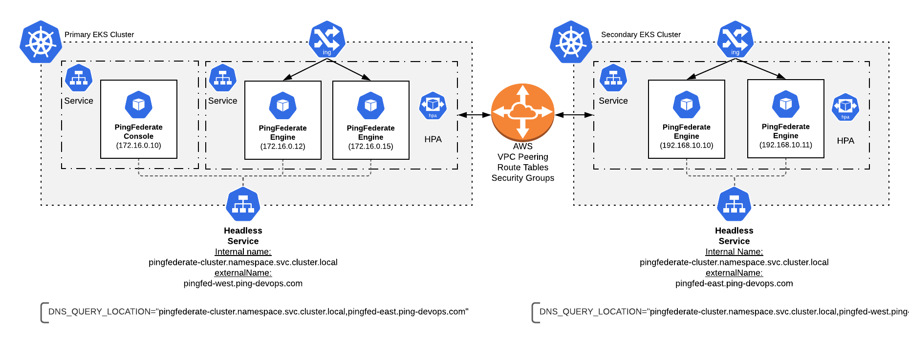
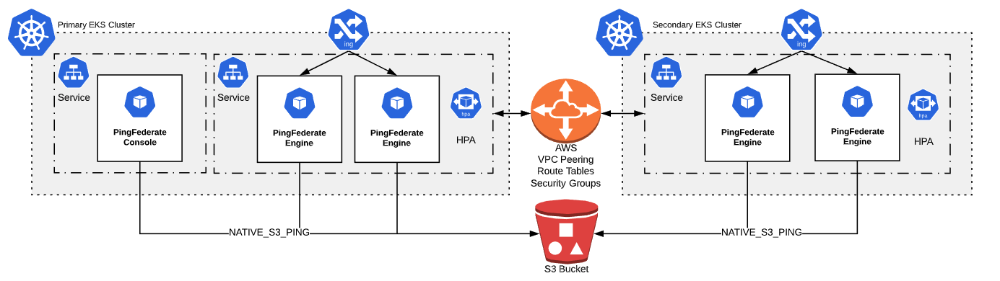

# PingFederate Cluster Across Multiple Kubernetes Clusters

This section will discuss deploying a single PingFederate cluster that spans across multiple Kubernetes clusters.

Having PingFederate in multiple regions doesn't always mean that spanning a single across clusters is necessary or optimal.
This scenario makes sense you have:

* Traffic that can cross between regions at any time. (us-west and us-east, and users may be routed to either)
* Configuration that needs to be the same in multiple regions **and** no reliable automation to ensure that

If all configuration changes are delivered via pipeline, and traffic wouldn't cross-regions, having separate PingFederate clusters can work.

!!! note
    The set of pre-requisites required for AWS kubernetes multi-clustering to be successful is found [Here](deployK8s-AWS.md)

## Overview

This section will focus on the optimal use of PingFederate features. Adaptive clustering and dynamic discovery of engines, to enable engine auto-scaling. Static engine lists, which may be used to extend traditional, on-premise PingFederate clusters is out of scope here.

## Discovery Options

There are two main dynamic discovery options:

### DNS_PING (PF > 10.2)

  

### S3 (PF < 10.1.x)

  

In either scenario, some pre-reqs must be achieved

## Prerequisites

* Two Kubernetes clusters created with the following requirements:
    * VPC IPs selected from RFC1918 CIDR blocks
    * The two cluster VPCs peered together
    * All appropriate routing tables modified in both clusters to send cross cluster traffic to the VPC peer connection
    * Security groups on both clusters to allow traffic for ports 7600 and 7700 to pass
    * Successfully verified that a pod in one cluster can connect to a pod in the second cluster on ports 7600 and 7700 (directly to the pods back-end IP, not an exposed service)
    > See example "AWS configuration" instructions [Here](deployK8s-AWS.md)
* envsubst
* kustomize

## Constants

In either scenario, some pieces will remain the same.
Yaml files that include:

1. Two deployments:
    * `pingfederate-admin` represents the admin console.
    * `pingfederate` represents the engine(s)

1. Two Configmaps. One for each deployment.
    * These configmaps are nearly identical, but define the operational mode separately.

1. Profile Files:
    * run.properties.subst
    * cluster-adaptive.conf.subst
    * tcp.xml.subst (using S3_PING, NATIVE_S3_PING, or DNS_PING)

1. Two Services:
    * One for each of the two deployments (9999 and 9031).

## Variables

For items specific to using S3 or DNS_PING follow the respective docs.

* [GA PF 10.2 onward, Using DNS_PING](deployPFMultiRegionDNS.md)
* [PF < 10.1.x Using S3](deployPFMultiRegionAWS.md) (referencing AWS S3, with possible application to Azure)