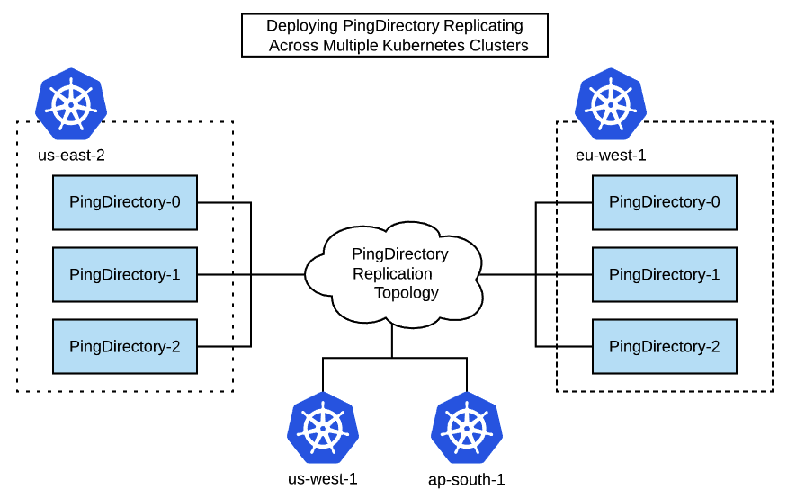

# Deploy PingDirectory Across Multiple Kubernetes Clusters

This example shows how to deploy PingDirectory containers that replicate across multiple Kubernetes clusters.



## Overview

Having a replicated PingDirectory topology across multiple Kubernetes clusters is desired for highly-available active/active deployments as well as active/partial-active scenarios where a hot backup is expected.

PingIdentity PingDirectory Docker images abstract away much of the complexity of replication initialization scripts, even across clusters. Instead, the focus is on providing accessible DNS hostnames across clusters and environment variables to build ordinal hostnames for each Directory instance.

### What You'll Do

1. [PingDirectory Host Naming](#pingdirectory-host-naming) - set the variables needed to create your hostnames
2. [Cluster Startup Walkthrough](#cluster-startup-walkthrough) - walk through what happens when a PingDirectory cluster starts
3. [Deploy the Helm Example](#deploy-the-helm-example) - deploy an example set of servers across multiple Kubernetes clusters

Because details within each Kubernetes cluster are well-hidden from outside the cluster, external access to each pod within the cluster is required. The PingDirectory images will set up access to each of the pods using load balancers from an external host, to allow each pod to communicate over the LDAP and replication protocols.

## PingDirectory Host Naming

The most important aspect of a successful PingDirectory cross-cluster deployment assigning accessible and logical dns hostnames.
Rules:

1. Each pingdirectory needs its own hostname avaialable in DNS
1. Hostnames will need to include the ordinal representing the instance in the statefulset
1. All hostnames must be accessible to all directory instances

These rules still leave plenty of room for flexibility. Especially when accounting for the cluster-native DNS names Kubernetes creates.

### Single-Cluster Multiple-Namespace

For example, if you were to simulate a "multi-cluster" environment in a single cluster, you could just set up two namespaces and create a separate ClusterIP service for each directory. It would env up like so:

#### Primary Cluster

| Pod | Service Name | Namespace | Hostname
|-----|-----|-----|-----|
|pindirectory-0 | pingdirectory-0 | primary | pingdirectory-0.primary|
|pindirectory-1 | pingdirectory-1 | primary | pingdirectory-1.primary|
|pindirectory-2 | pingdirectory-2 | primary | pingdirectory-2.primary|

#### Secondary Cluster

| Pod | Service Name | Namespace | Hostname
|-----|-----|-----|-----|
|pindirectory-0 | pingdirectory-0 | secondary | pingdirectory-0.secondary|
|pindirectory-1 | pingdirectory-1 | secondary | pingdirectory-1.secondary|
|pindirectory-2 | pingdirectory-2 | secondary | pingdirectory-2.secondary|

### External DNS Names

In a Prod Environment with external hostnames it may look more like:

#### us-west cluster

| Pod | Service Name | DNS / Hostname
|-----|-----|-----|
|pindirectory-0 | pingdirectory-0 | pingdirectory-0-us-west.ping-devops.com|
|pindirectory-1 | pingdirectory-1 | pingdirectory-1-us-west.ping-devops.com|
|pindirectory-2 | pingdirectory-2 | pingdirectory-2-us-west.ping-devops.com|

#### us-east cluster

| Pod | Service Name | DNS / Hostname
|-----|-----|-----|
|pindirectory-0 | pingdirectory-0 | pingdirectory-0-us-east.ping-devops.com|
|pindirectory-1 | pingdirectory-1 | pingdirectory-1-us-east.ping-devops.com|
|pindirectory-2 | pingdirectory-2 | pingdirectory-2-us-east.ping-devops.com|

## Variables to Create Hostnames

To provide flexibility on how PingDirectory will find other instances, a full dns hostname is broken into multiple variables.

| Variable | Description |
|---|---|
| `K8S_POD_HOSTNAME_PREFIX` | The string used as the prefix for all host names.  Defaults to the name of the `StatefulSet`. |
| `K8S_POD_HOSTNAME_SUFFIX` | The string used as the suffix for all pod host names.  Defaults to `K8S_CLUSTER`. |
| `K8S_SEED_HOSTNAME_SUFFIX` | The string used as the suffix for all seed host names.  Defaults to `K8S_SEED_CLUSTER` (discussed later). |

A full hostname is created like:

```shell
${K8S_POD_HOSTNAME_PREFIX}<instance-ordinal>${K8S_SEED_HOSTNAME_SUFFIX}
```

### Using Previous Hostname Examples

| hostname | K8S_POD_HOSTNAME_PREFIX | K8S_POD_HOSTNAME_SUFFIX | K8S_SEED_HOSTNAME_SUFFIX |
|---|:---:|---|---|
| pingdirectory-0.primary|`pingdirectory-`| `.primary`|`.primary`|
| pingdirectory-2-us-west.ping-devops.com| `pingdirectory-`|`-us-west.ping-devops.com`|`-us-west.ping-devops.com`|


## Environment Variables

| Variable | Required | Description |
|---|:---:|---|
| `K8S_CLUSTERS` | *** | The total list of Kubernetes clusters that the StatefulSet will replicate to. |
| `K8S_CLUSTER` | *** | The Kubernetes cluster the StatefulSet will be deployed to. |
| `K8S_SEED_CLUSTER` | *** | The Kubernetes cluster that the seed server is deployed to. |
| `K8S_NUM_REPLICAS` |     | The number of replicas that make up the StatefulSet. |
| `K8S_POD_HOSTNAME_PREFIX` |     | The string used as the prefix for all host names.  Defaults to `StatefulSet`. |
| `K8S_POD_HOSTNAME_SUFFIX` |     | The string used as the suffix for all pod host names.  Defaults to `K8S_CLUSTER`. |
| `K8S_SEED_HOSTNAME_SUFFIX` |     | The string used as the suffix for all seed host names.  Defaults to `K8S_SEED_CLUSTER`. |
| `K8S_INCREMENT_PORTS` |     | `true` or `false`.  If `true`, each pod's port will be incremented by 1. |

An example of the YAML configuration for these environment variables:

```yaml
K8S_STATEFUL_SET_NAME=pingdirectory
K8S_STATEFUL_SET_SERVICE_NAME=pingdirectory

K8S_CLUSTERS=us-east-2 eu-west-1
K8S_CLUSTER=us-east-2
K8S_SEED_CLUSTER=us-east-2
K8S_NUM_REPLICAS=3

K8S_POD_HOSTNAME_PREFIX=pd-
K8S_POD_HOSTNAME_SUFFIX=.us-cluster.ping-devops.com
K8S_SEED_HOSTNAME_SUFFIX=.us-cluster.ping-devops.com

K8S_INCREMENT_PORTS=true
LDAPS_PORT=8600
REPLICATION_PORT=8700
```

These environment variable settings would map out like this:

| Seed | Instance | Host name | LDAP | REPL |
| :---: | --- | --- | :---: | :---: |
|      | CLUSTER: us-east-2
| ***  | pingdirectory-0.us-east-2 | pd-0.us-cluster.ping-devops.com | 8600  | 8700 |
|      | pingdirectory-1.us-east-2 | pd-1.us-cluster.ping-devops.com | 8601  | 8701 |
|      | pingdirectory-2.us-east-2 | pd-2.us-cluster.ping-devops.com | 8602  | 8702 |
|      | CLUSTER: eu-west-1
|      | pingdirectory-0.eu-west-1 | pd-0.eu-cluster.ping-devops.com | 8600  | 8700 |
|      | pingdirectory-1.eu-west-1 | pd-1.eu-cluster.ping-devops.com | 8601  | 8701 |
|      | pingdirectory-2.eu-west-1 | pd-2.eu-cluster.ping-devops.com | 8602  | 8702 |

## Cluster Startup Walkthrough

Yes, that was a _ton_ of variable conversation.
This is done to for flexibility to accommodate various infrastructure constraints. For example, in some environments you cannot use the same port for each instance, so we must accommodate incrementing ports.

Next, it's helpful to know what happens when a cluster starts, to understand why the initial creation of a cluster must be very prescriptive.

1. The first pod must start on it's own and become healthy. This is critical to prevent replication islands. The very first time the very first pod starts, we call it "GENESIS". All other pods are dependent on this `SEED_POD` in the `SEED_CLUSTER` starting correctly on it's own. The entire purpose of defining `SEED_POD` and `SEED_CLUSTER` variables is avoid multiple genesis scenarios.

2. once the first pod is healthy, it begins dns querying combinations of hostnames at their LDAPS port to find another Directory instance.

In our first cluster, this would be the hostname of pingdirectory-1. but it could also be pingdirectory-0 of another cluster. Once the query returns successful, creation of the replication topology automatically begins.

From this point onward, the order in which instances start is less important.

## Deploy the Helm Example

Clone the `getting-started` [Repository](https://github.com/pingidentity/pingidentity-devops-getting-started) to get the Helm values yaml for the exercise (30-helm/multi-region/pingdirectory), then:

1. Modify any external hostnames in the sample values yaml files as necessary - see the lines under `## CHANGEME` comments

2. Deploy the first set of pods

    ```sh
    kubectx west
    helm upgrade --install example pingidentity/ping-devops -f 01-west.yaml
    ```

3. Wait for the example-pingdirectory pods to be running and ready.

4. Deploy the second set of pods

    ```sh
    kubectx east
    helm upgrade --install example pingidentity/ping-devops -f 02-east.yaml
    ```

5. Wait for all example-pingdirectory pods to be running and ready.

6. Verify that pods are replicating
  
    ```sh
    kubectx west
    kubectl exec example-pingdirectory-0 -- dsreplication status --showAll
    ```

## Clean up Helm Releases

```sh
kubectx west
helm uninstall example
kubectl delete pvc --selector=app.kubernetes.io/instance=example
kubectx east
helm uninstall example
kubectl delete pvc --selector=app.kubernetes.io/instance=example
```
