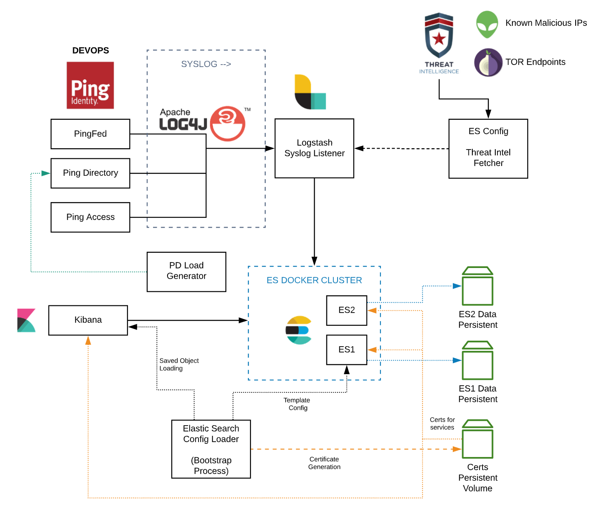
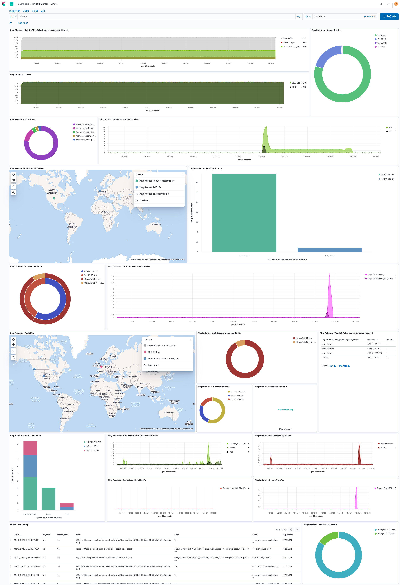

# Deploy an Elasticsearch SIEM Stack

This example deploys a PingFederate, PingAccess, and PingDirectory stack with Elasticsearch infrastructure built in for visualizing traffic and other security or log data. The architecture looks like this:



* Threat intel and TOR Endpoints are  provided by AlienVault and the TOR Network Endpoint List.

* Threat feeds are updated on an interval via setting an environment variable in `docker-compose.yaml`.

> **Warning**: This stack is not intended for production environments.

## Prerequisites

* You've already been through [Get Started](../get-started/getStarted.md) to set up your DevOps environment and run a test deployment of the products.

* For most Linux distributions (local or on a platform), you'll need to increase the `vm.max_map_count` setting to support the necessary heap size. Enter:

  ```sh
  sudo sysctl -w vm.max_map_count=262144
  ```

  Your Linux machine needs at least 12 Gb of RAM for Docker to run this stack.

* For Apple macos or Microsoft Windows machines, ensure the Docker Resources is set to a *minimum* 10 Gb of RAM, or the containers will crash.

* For Amazon Web Services (AWS) use a M5.XL or M5a.XL VPC. 16 Gb RAM is required, and at least 50 Gb of storage is recommended.

### Optional

* If you're using Slack, you can generate a Slack Webhook URL from the Slack Admin for alerting: `https://api.slack.com/messaging/webhooks`.

## Instal Setup

1. From the `pingidentity-devops-getting-started` directory, pull the repo to ensure that you have current files:

      ```sh
      git pull
      ```

1. Go to the `pingidentity-devops-getting-started/11-docker-compose/11-siem-stack/` directory.

1. Create a `siem.env` file in the `11-siem-stack` directory, and copy these entries into the `siem.env` file:

      ```sh
      COMPOSE_PROJECT_NAME=es
      ELASTIC_VERSION=7.6.1

      ELASTIC_PASSWORD=2FederateM0re
      ES_ADMIN_PD_USER_PASS=FederateTheB3st!

      PING_IDENTITY_DEVOPS_USER=<your-username>
      PING_IDENTITY_DEVOPS_KEY=<your-key>
      ```

## Deploy Stack

1. From the `pingidentity-devops-getting-started/11-docker-compose/11-siem-stack/` directory, start the stack:

      ```sh
      docker-compose up -d
      ```

      Monitor the container startup using one of these commands:

      ```sh
      docker-compose ps
      ```

      ```sh
      docker-compose logs -f
      ```

1. (Optional) If you're using Slack, and you've already created your Webhook URL (see the optional prerequisite above), you can run the Slack configuration script to configure slack alerts:

      ```sh
      ./config_slack_alerts
      ```

      The script prompts for your Webhook URL and Elasticsearch password.

      * The Webhook URL updates the destination for your alerts within Slack.
      * The password is used to push watchers into Elasticsearch.

      You don't need to provide your Webhook URL in the future. If you don't provide it, it simply will not update it.

      You can re-run this script any time. This will update and push new watchers you create from the `./elasticsearch-siem/watchers` folder.

## Post-Deployment

When PingDirectory is up and healthy:

* Kibana console:

  * URL: `https://localhost:5601/`.
  * User name: `es_admin` or `elastic` (local user).
  * Password: FederateTheB3st! (the `ES_ADMIN_PD_USER_PASS` value in the `siem.env` file you created).

* Kibana saved objects

  You can load the saved objects by going to "Saved Objects" under the Kibana settings and exporting all. The exported file is saved in `./elasticsearch-siem/kibana_config/kib_base.ndjson`.

* Elasticsearch templates for indexes

  Index mappings and config are stored in the `./elasticsearch-siem/index_templates` directory. The scripts will load the template or templates when the cluster state is green.

* Logstash pipeline

  * TOR Enrichment
  * Threat Intel (Alien Vault Provided)
  * GEO IP Lookup
  * GEO Distance Query (template driven)
  * Data Parsing
  * The Logstash pipeline is stored in the directory structure. It includes parsers for all Ping Identity log sources.

## Cleaning Up

There are persistent volumes used for Elasticsearch data and certificates, so you'll also need to clear the volumes when you bring the stack down. Enter:

```sh
docker-compose down
docker volume prune
```

## Dashboard Examples

### PingFederate Threat Intel Dashboard


### Ping Identity SIEM Dashboard



### Ping Federate Dashboard

Audit and System logs are delivered (set to Debug by default). For Log4J, PingFederate sends logs on 2 different Syslog ports using a custom mapping.


### PingAccess Dashboard

Audit and System logs are delivered (set to Debug by default). For Log4J, PingAccess sends logs on 2 different Syslog ports using a custom mapping.


### PingDirectory Dashboard

Audit logs are being delivered. There are 2 containers that produce load. These are disabled by default. You can uncomment these entries in the `docker-compose.yaml` file to use them:

* authrate_ok
* authrate_ko

For Log4J, PingDirectory sends logs on 1 Syslog port using a custom mapping.


## Included Slack Alerts

These can be customized through Watchers:

* User authenticates over 1200km away within a 6 hour period.
* User authenticates successfully from TOR through Ping Federate (potential credential theft).
* User authenticates successfully from Known Malicious IP through Ping Federate (potential credential theft).
* Account Lockout detected through Ping Federate (potential brute force).
* Likely SAML signature modifications (forced tampering with authentication protocols).

### Slack Alert Examples (not all are shown)

These are Low / Medium / High alert examples:


