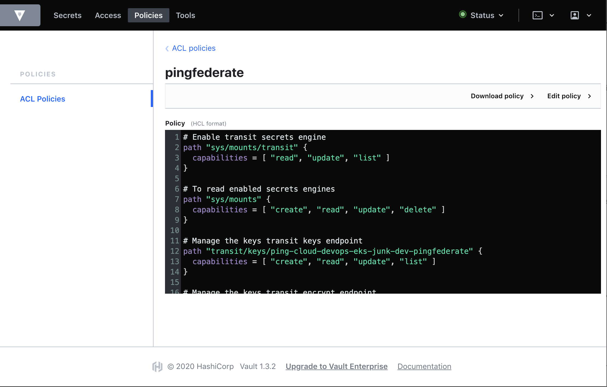

# Deploy Hashicorp Vault

This is an example of deploying Hashicorp Vault (Vault) with PingFederate and PingAccess to manage their corresponding master keys (`pf.pwk` and `pa.pwk`). Using Vault, you can also manage license files, DevOps keys, product secrets, and others.

## What you'll do

You'll clone the Vault Helm chart to deploy a near-production environment to validate and manage the product master keys, product secrets, and authentication policies.

## Prerequisites

- You've already been through [Get started](../get-started/getStarted.md) to set up your DevOps environment and run a test deployment of the products.
- [Vault](https://www.vaultproject.io/).
- [Helm](https://helm.sh/docs/intro/install/). Vault uses Helm 3.
- Kubernetes 1.7
- OpenSSL or your favorite PKI tool.
- Pull our [pingidentity-getting-started repo](https://github.com/pingidentity/pingidentity-devops-getting-started) to ensure you have the latest sources.

## Deployment architecture

Illustrated below are the specific configuration items we are using for this deployment. Additionally, we'll deploy Vault into Amazon Elastic Kubernetes Service (EKS) and using some of AWS's specific services ([AWS KMS](https://aws.amazon.com/kms/) and [AWS DynamoDB](https://aws.amazon.com/dynamodb/)) to help simplify the deployment architecture.


## Enable TLS

Before you deploy Vault using Helm, you'll need to add the TLS key pair (public and private keys) and CA chain files as a Kubernetes secret. The public certificate and private key need to be separate files. You can either use OpenSSL to quickly create a self-signed certificate, or use one signed by your Certificate Authority.

> If you're using a self-signed certificate, the public certificate is also the CA certificate.

1. Create the Kubernetes secret using Vault, the TLS key pair, and the certificate:

   ```shell
   kubectl create secret generic vault-certstore \
    --from-file=vault.key=<local_path_to_tls_key>/tls.key \
    --from-file=vault.crt=<local_path_to_tls_cert>/tls.crt \
    --from-file=vault.ca=<local_path_to_ca_cert>/vault.ca
   ```

2. Ensure that these parameters in the `values.yaml` file located in your local `pingidentity-devops-getting-started/20-kubernetes/08-vault/vault-helm` directory are set as follows:

* `global:`

  Enable TLS globally:

  ``` yaml
  global:
    tlsDisable: false
  ```

* `extraEnvironmentVars:`

  Set the environment variable that will contain the path to the CA Certificate used for TLS.

  ```yaml
  extraEnvironmentVars:
    VAULT_CACERT: /vault/userconfig/vault-certstore/vault.ca
  ```

* `extraVolumes:`

  Set the volume mount for the certificate store secret. This mount will contain the TLS public certificate, private key and CA certificate.

  ```yaml
  extraVolumes:
    - type: secret
      name: vault-certstore
  ```

* `ha:`

  Set Vault to use high-availability (HA) mode. Vault uses Hashicorp Consul for its storage backend. The default configuration provided will work with the Consul (Helm) project by default. You can also manually configure Vault to use a different HA backend.

  ```yaml
    ha:
      enabled: true
      replicas: 3

  # Add the following parameters to the `listener "tcp"` element to enable TLS:

      config: |
        ui = true
        log_level = "Debug"

        listener "tcp" {
          tls_disable = 0
          address = "[::]:8200"
          cluster_address = "[::]:8201"
          tls_cert_file = "/vault/userconfig/vault-certstore/vault.crt"
          tls_key_file  = "/vault/userconfig/vault-certstore/vault.key"
          tls_client_ca_file = "/vault/userconfig/vault-certstore/vault.ca"
        }
  ```

## Storage Backend

We can take advantage of some AWS services to simplify our deployment architecture. The Vault Helm chart has examples for using files and/or an existing Consul deployment. Here, we'll update Vault's HA deployment to use AWS DynamoDB.

1. Create an AWS access key and secret with permissions to manage the dynamodb.

   You'll find the permissions that the Vault IAM user requires to manage dynamodb in the Vault documentation [Required AWS Permissions](https://www.vaultproject.io/docs/configuration/storage/dynamodb/#required-aws-permissions).

   > Vault will create the necessary table in dynamodb if it does not already exist.

   See the Vault documentation [DynamoDB Storage Backend](https://www.vaultproject.io/docs/configuration/storage/dynamodb/) for additional parameters when using dynamodb as a storage mechanism.

2. Add your AWS access and secret key as a Kubernetes secret:

   ```shell
   kubectl create secret generic dynamodb-access-secret-keys \
     --from-literal=AWS_ACCESS_KEY_ID=<your_aws_access_key> \
     --from-literal=AWS_SECRET_ACCESS_KEY=<your_aws_access_key_secret>
   ```

3. Kubernetes can provide the secrets as environment variables that Vault can use, so you do not accidentally expose your the secret outside of Kubernetes. Update the `values.yaml` file to include your AWS key and secret within the `extraSecretEnvironmentVars` section:

   ```yaml
     extraSecretEnvironmentVars:
     - envName: AWS_SECRET_ACCESS_KEY
       secretName: dynamodb-access-secret-key
       secretKey: AWS_SECRET_ACCESS_KEY
     - envName: AWS_ACCESS_KEY_ID
       secretName: dynamodb-access-secret-key
       secretKey: AWS_ACCESS_KEY_ID
   ```

4. In the `ha` section, update the `dynamodb` storage element with your corresponding AWS region and dynamodb table name:

   ```yaml
         storage "dynamodb" {
           ha_enabled = "true"
           region = "<aws_region>"
           table = "<dynamodb_table_name>"
         }
   ```

## Auto Unseal

To keep things simple, we'll use Vault's Auto Unseal with the AWS Key Management Service (KMS).

You'll need to set up your existing AWS access key and secret with the correct permissions. Because we're using dynamodb for backend storage, you'll also add the permissions to your AWS access key.

See the Vault documentation [AWS KMS authentication](https://www.vaultproject.io/docs/configuration/seal/awskms/#authentication) for more information.

Vault can retrieve the AWS KMS key using an environment variable, so it is not accidentally exposed outside of the Kubernetes environment.

1. Add the KMS key as a Kubernetes secret:

   ```shell
   kubectl create secret generic aws-kms-key-id \
     --from-literal=KMS_KEY_ID=<your_key_id>
   ```

2. Update the `values.yaml` file to include your AWS key and secret in the `extraSecretEnvironmentVars` section:

   ```yaml
     extraSecretEnvironmentVars:
     - envName: VAULT_AWSKMS_SEAL_KEY_ID
       secretName: aws-kms-key-id
       secretKey: KMS_KEY_ID
   ```

3. In the `ha` section config map (`config`), add a `seal` element, and update the region parameter with your AWS region value:

   ```yaml
         seal "awskms" {
           region = "<aws_region>"
         }
   ```

## Deploy Vault using Helm

See the Vault documentation for [Kubernetes](https://www.vaultproject.io/docs/platform/k8s) for complete information.

1. Go to your local `pingidentity-devops-getting-started/20-kubernetes/08-vault/vault-helm` directory and enter:

   ```shell
   helm install vault /.
   ```

   Information similar to the following will be displayed:

   ```shell
    NAME: vault
   LAST DEPLOYED: Thu Mar 12 17:27:19 2020
   NAMESPACE: ping-cloud-devops-eks
   STATUS: deployed
   REVISION: 1
   TEST SUITE: None
   NOTES:
    Thank you for installing HashiCorp Vault!
    Your release is named vault. To learn more about the release, try:

    $ helm status vault
    $ helm get vault
   ```

2. If this is the first time you've deployed Vault in this environment, you'll need to initialize it. Enter:

   ```shell
   kubectl exec vault-0 -- vault operator init
   ```

   If the initialization is successful, you'll receive the recovery keys and Initial Root token. Make sure you store the recovery keys and root token in a secure location. Information similar to the following is displayed:

   ```shell
   Recovery Key 1: <key_1>
   Recovery Key 2: <key_2>
   Recovery Key 3: <key_3>
   Recovery Key 4: <key_4>
   Recovery Key 5: <key_5>

   Initial Root Token: <root_token>

   Success! Vault is initialized

   Recovery key initialized with 5 key shares and a key threshold of 3. Please
   securely distribute the key shares printed above.
   ```

## Pod Authentication

Our products and applications need to have a Vault client token to authenticate to Vault. Because we're using Kubernetes, we can use Vault's Kubernetes auth method.

When the Kubernetes auth method is enabled, Vault can use a pod's Kubernetes service account token to authenticate and exchange for a Vault client token. The Vault client token is associated with a particular role with permissions to perform certain Vault operations.

1. Attach to the namespace where the Vault will be deployed:

   ```shell
   kubens ping-cloud-devops-eks-vault
   ```

   Vault's cluster role binding creates a service account `vault` to perform delegated authentication and authorization checks. This service account is used by the Kubernetes authentication mechanism to allow authentication by other applications.

2. Retrieve the service account secret name and set the environment variable `SA_SECRET_NAME`:

   ```shell
   export SA_SECRET_NAME=$(kubectl get serviceaccounts vault -o jsonpath="{.secrets[].name}")
   ```

3. Save the service account CA certificate, Kubernetes cluster API hostname, and the service account token to environment variables. These variable values will be used in the Kerberos auth method configuration.

   a. Save the service account CA certificate:

   ```shell
   export SA_CA_CRT=$(kubectl get secret $SA_SECRET_NAME -o jsonpath="{.data['ca\.crt']}" | base64 --decode; echo)
   ```

   b. Save the Kubernetes cluster API hostname:

   ```shell
   export K8S_API_HOST=$(kubectl config view --minify -o jsonpath='{.clusters[0].cluster.server}')
   ```

   c. Save the service account token:

   ```
   export SA_TOKEN=$(kubectl get secret $SA_SECRET_NAME -o jsonpath="{.data['token']}" | base64 --decode; echo)
   ```

### Add Vault policies

You can choose the method to use to add the policies to your Vault:

* CLI
* API
* UI

You'll need to add to Vault the policy files `pingfederate.hcl` and `pingaccess.hcl` to ensure the products have access only to their own secrets and keys.

Be sure to update the `<namespace>` and `<env>` tags in your policy files with the appropriate values. The recommended value for `<namespace>` is your Kubernetes namespace. The typical values for `<env>` are dev, staging, and prod. For example:

  ```text
  <namespace> : ping-cloud-eks-bob
  <env> : dev
  ```

#### Adding the policies using the CLI

Connect to a Vault pod and enter the following at the command line:

> Showing PingFederate entries here. You'll need to do the same for PingAccess.

  ```shell
  vault policy write <namespace>-<env>-pingfederate -<<
  # Enable transit secrets engine
  path "sys/mounts/transit" {
    capabilities = [ "read", "update", "list" ]
  }

  # To read enabled secrets engines
  path "sys/mounts" {
    capabilities = [ "create", "read", "update", "delete" ]
  }

  # Manage the keys transit keys endpoint
  path "transit/keys/<namespace>-<environment>-pingfederate" {
    capabilities = [ "create", "read", "update", "list" ]
  }

  # Manage the keys transit keys endpoint
  path "transit/encrypt/<namespace>-<environment>-pingfederate" {
    capabilities = [ "create", "read", "update", "list" ]
  }

  # Manage the keys transit keys endpoint
  path "transit/decrypt/<namespace>-<environment>-pingfederate" {
    capabilities = [ "create", "read", "update", "list" ]
  }

  #Manage the cubbyhole secrets engine
  path "cubbyhole/<namespace>/<env>/pingfederate/masterkey" {
    capabilities = [ "create", "read", "update", "list" ]
  }
  EOF
  ```

#### Using the API

Your client needs to be able to access the Vault API endpoint. For example:

  ```shell
  curl \
      --header "X-Vault-Token: ..." \
      --request PUT \
      --data @pingfederate-policy.hcl \
      http://127.0.0.1:8200/v1/sys/policy/<namespace>-<env>-pingfederate
  ```

#### Using the Vault UI

Port-forward the Vault port for the UI, go to `https://localhost:<vault-ui-port>, and add the entries (as shown for the CLI method):

> Showing PingFederate entries here. You'll need to do the same for PingAccess.




### Configure Kubernetes Auth

You need to enable Kubernetes auth. It's important to note that Vault doesn't need to be deployed in a Kubernetes environment to support Kubernetes auth. You're also able to support multiple kubernetes clusters.

The following commands can be performed by the Vault admin or a configuration management tool.

Enable Kubernetes auth:

  ```shell
  kubectl exec vault-0 -- vault auth enable kubernetes
  ```

Configure Kubernetes auth:

  ```shell
  kubectl exec vault-0 -- vault write auth/kubernetes/config \
  token_reviewer_jwt=$SA_TOKEN \
  kubernetes_host=$K8S_API_HOST \
  kubernetes_ca_cert=$SA_CA_CRT
  ```

Register a role for each product. To give you more control over product permissions, we'll use this naming convention for roles: `<k8s-namespace>-<environment>-<product_name>`. For example

  ```text
    k8s-namespace = ping-cloud-devops-eks-apps
    environment = dev
    product_name = pingfederate

    ping-cloud-devops-eks-apps-dev-pingfederate
  ```

To register the roles, update the following command with your role name, the product namespace, and policy name before executing:

  ```
  kubectl exec vault-0 -- vault write auth/kubernetes/role/<namespace>-<environment>-<product_name> \
          bound_service_account_names=vault-auth \
          bound_service_account_namespaces=<application_namespace> \
          policies=<policy>
  ```

### Transit Secret Engine

The Transit secret engine uses a Vault-managed key to support encryption and decryption of each product's master key. Each product implements a common interface (MasterKeyEncryptor) that will encrypt the master key while at rest.

### CubbyHole Secret Engine

The CubbyHole secret engine is used to store the master key for each product. This is to assist backups and restoration. In addition, this can be used to assist with migrating configurations from one environment to another (for example, from dev to staging).
