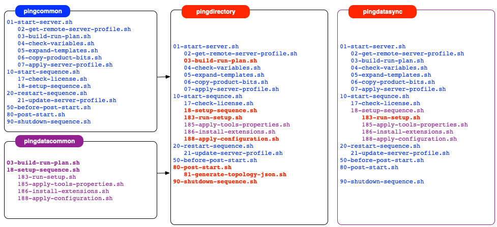

# Docker Builds - Hooks

**Audience** - Operators of DevOps Cloud environments. Not intended for Developers and admins of the Ping Identity products.

**Description** - This document describes the many number of scripts that are called in during the lifecycle of a Ping Identity docker image from the initial `entrypoint.sh` script.

Included with the base docker images, there is an example/stub provided for all possible hooks. It is **very important** that these names be used if a developer wishes to make subtle changes to their server-profile.

The full ordered list of scripts that are called depending on what type of image \(i.e. pingdirectory or pingdatasync\) are:

## Hooks Details
Details on hooks can be found within the code of each hook in the [Docker-Builds Repo](https://github.com/pingidentity/pingidentity-docker-builds) as well in `pingidentity-devops-getting-started/docs/docker-images/<image_name>/hooks` for each of the products images.
