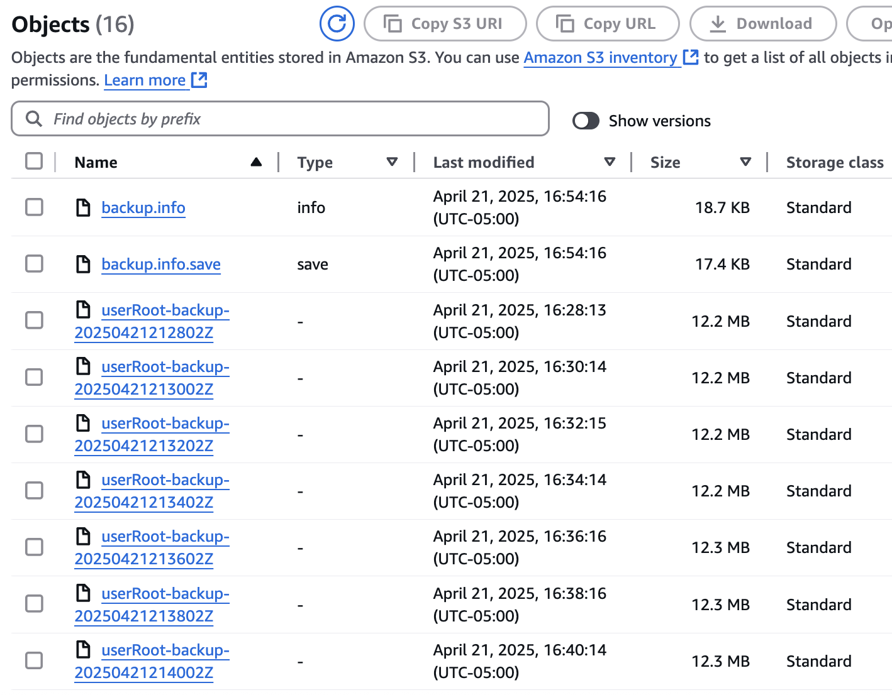

# S3 Archive of a PingDirectory Backup

!!! error "Demonstration Only"
    This guide is for demonstration purposes only. It is not intended for production use and is just one of many ways of archiving files to S3.  Other storage options are available, depending on your provider.

## Before you begin

You must:

* Complete [Get Started](../get-started/introduction.md) to set up your DevOps environment and run a test deployment of the products

## High-level steps

* Have some means of creating a backup of PingDirectory.  For this guide, an extension of the [PingDirectory Backup and Sidecar](https://raw.githubusercontent.com/pingidentity/pingidentity-devops-getting-started/master/30-helm/pingdirectory-backup/pingdirectory-periodic-backup.yaml) is used.
* After the backup is made, use an archive script to upload the backup to S3.
* (Optional) Clean up the image filesystem of backups.

## File exploration

In the `30-helm/s3-sidecar` directory of this repository, you will find the following files:

### Dockerfile

This file extends the PingToolkit image, adding the AWS CLI.

```sh
## Dockerfile for AWS CLI
## For demonstration purposes only
## Not intended for production use
FROM pingidentity/pingtoolkit:latest

USER root

# Install AWS CLI
RUN curl "https://awscli.amazonaws.com/awscli-exe-linux-x86_64.zip" -o "awscliv2.zip" \
    && unzip awscliv2.zip \
    && ./aws/install \
    && sleep 5 \
    && rm -rf ./aws*

USER 9031:0
```

After the image is built, it will need to be tagged and pushed to a repository that is accessible to the Kubernetes cluster.

### pd-archive-backup-to-s3.yaml

This file will not be repeated in full here.  The top section creates ConfigMaps that define three sample scripts:

* **archive.sh** - This demonstration script is called by the sidecar container to archive the backup to S3 using a single command.  The bucket name and path will need to be updated to match your environment.
* **backup.sh** - This demonstration script is called by the sidecar container to create a backup of PingDirectory.  It also calls the archive.sh script with no error handling or testing.
* **restore.sh** - This demonstration script is called by the sidecar container to restore a backup of PingDirectory.

These scripts are placed into the sidecar image in the /opt/in directory.

Lines 194 and 195 will need modification to point to the registry and tag for the image with the AWS utilities added.

## Operation

The process ran by this demonstration is straightforward.  Every 6 hours:

* A backup of the PingDirectory data is created
* The backup is archived to S3

PingDirectory handles the removal of old backups based on the parameters set in the backup script.

If you are observing the cluster at the time of the backup, an additional pod launches to execute the cronjob.  This pod terminates after the backup is complete.

Over time, the S3 bucket will appear similar to the following.  For purposes of this screenshot, the backup and archive process ran every 5 minutes.


