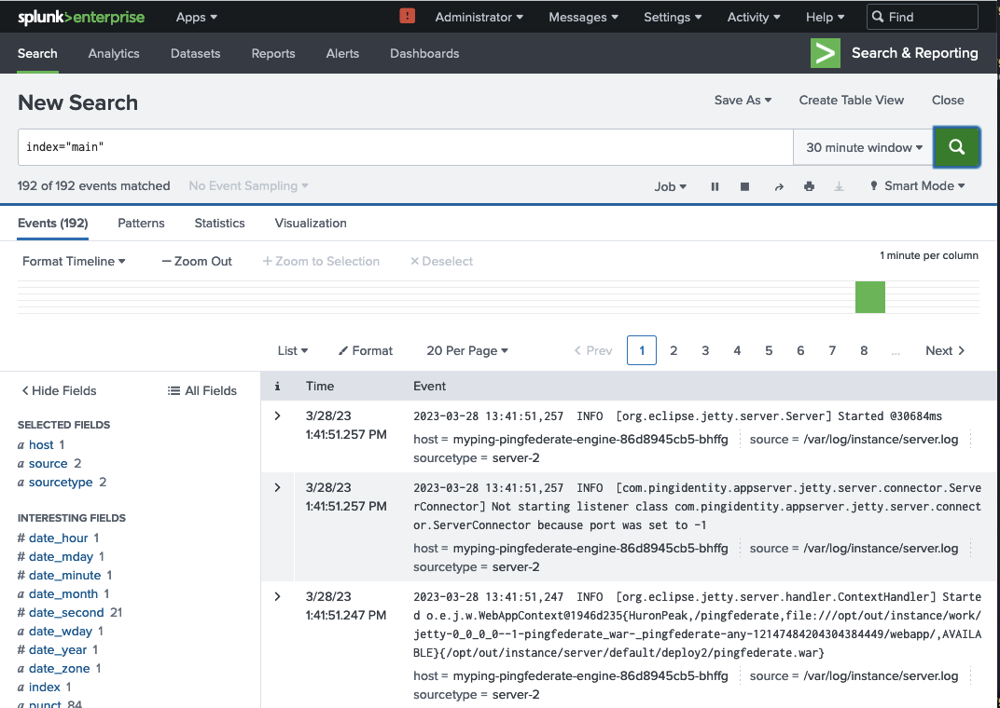
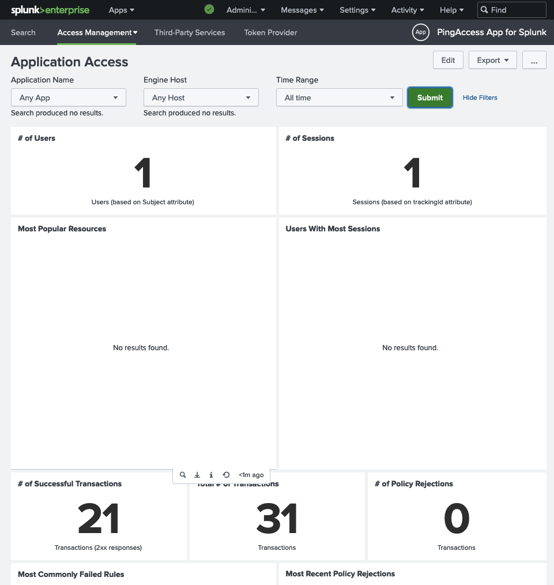

# Forwarding PingFederate and PingAccess logs to Splunk

This page provides an example of how PingFederate and PingAccess logs can be shipped to Splunk.  The principle of using a container for a single purpose is followed, and a sidecar for log collection and forwarding is placed in the appropriate Ping product pods.

!!! note "Video demonstration"
    For a video demonstration of this process, visit [this link](https://videos.pingidentity.com/detail/videos/devops/video/6323662641112/splunk-logging-demonstration).

!!! note "Splunk Demonstration Only"
    This guide is for demonstration purposes only, but the principles will apply to a production implementation.  In addition, the process for other logging solutions will be similar.

## Components Used

1. Ping DevOps Helm Chart
1. Ping server-profiles repository
1. Splunk Deployment
1. Splunk Universal Forwarder Docker image

## Prerequisites

- Access to a Kubernetes cluster.  For this guide, a local Kubernetes cluster with the nginx-ingress controller and the MetalLB load balancer was used.  You might have to adjust how you access the product interface URLs, depending on your environment.
- Helm pingidentity/ping-devops chart >= 0.9.11

## Overall Process

1. Configure the cluster environment
1. Deploy Splunk Enterprise
1. Configure Splunk and generate an HTTP Event Collector (HEC) token
1. Create a configmap with the token for use by the Splunk Universal Forwarder (UF) sidecar
1. Use Helm to deploy PingFederate and PingAccess with the sidecar attached to the engine pods
1. Confirm logs and activity are visible in Splunk

## Cluster preparation

```sh
# Create the namespace
kubectl create ns splunk

# Set the kubectl context to the namespace
kubectl config set-context --current --namespace=splunk

# Confirm
kubectl config view --minify | grep namespace:
```

## Splunk Server deployment

Deploy the Splunk application:

```sh
# Clone the `pingidentity-devops-getting-started` repository to a local directory
git clone \
  https://github.com/pingidentity/pingidentity-devops-getting-started.git

cd pingidentity-devops-getting-started

# Deploy Splunk
# The splunk.yaml file assumes a load balancer is available in the cluster
kubectl apply -f 20-kubernetes/splunk/splunk.yaml

# Determine IP address assigned
# 8000 is HTTP; 8088 is HTTPS
kubectl get svc

NAME     TYPE           CLUSTER-IP     EXTERNAL-IP       PORT(S)
splunk   LoadBalancer   10.105.171.4   192.168.163.172   8000:30416/TCP,8088:30364/TCP,9997:31770/TCP,9990:32292/UDP

# Create corresponding entry in /etc/hosts
# If your cluster has publicly-accessible IPs and DNS support, this step is not necessary
# You would use the DNS entry assigned to the service.
192.168.163.172 splunk.pingdemo.example
```

## Configure Splunk

In this section, you will prepare Splunk for the logs from the products.

!!! error "Data Persistence"
    In this demo, there is no data persistence for Splunk.  If you restart the Splunk pod, you will lose everything that is configured in the following steps.

- Navigate to the UI in a browser at `http://splunk.pingdemo.example:8000/en-US/account`. 
- Login with the credentials **admin / 2FederateM0re!**

### Create an index

- Navigate to **Settings > Indexes** and click the **New Index** button at the upper-right.
- Provide **pinglogs** as the Index Name.
- Accept all defaults and click **Save**.

###  Create an HTTP Event Collector (HEC)
- Navigate to **Settings > Data inputs** and click **Add New** in the `HTTP Event Collector` row.
- A wizard is launched and you are taken to the **Select Source** step.  Type `pinglogs` as the name and click the **Next** button in the upper panel.
- In the **Input Settings** step, add the `pinglogs` index to the **Selected item(s)** box by clicking on it in the **Available item(s)** list, then click the **Review** button in the upper panel.
- Confirm your entries and click the **Submit** button in the upper panel.
- A token is generated.  Save this token to a scratch file or buffer for use in configuring Splunk in a moment.

### Add the Ping product applications to Splunk

- Navigate to **Apps > Find More Apps**.  The Apps link is at the upper-left of the UI.
- Filter the list of applications using `Ping`.  Add the **PingFederate** and **PingAccess** Apps for Splunk.

!!! warning "Splunk Account"
    You will need valid credentials from Splunk to install the applications.  You can use a free trial if necessary.

!!! note "PingDirectory App"
    While not shown in this example, Ping also provides a Splunk App for PingDirectory.  You would need to attach the Splunk UF sidecar to your PingDirectory pods as done here for PingFederate and PingAccess.

### Create a configmap
Use the HEC token generated earlier to update the file `20-kubernetes/splunk/splunk-config-init.yaml` (search for **#CHANGEME**).

Apply the file:

```sh
kubectl apply -f 20-kubernetes/splunk/splunk-config-init.yaml
```

## Deploy the Ping stack with Splunk UF as a sidecar

```sh
# Create the DevOps secret for temporary Ping license
pingctl k8s generate devops-secret | kubectl apply -f -

# Install Ping and Ingress
helm upgrade --install myping pingidentity/ping-devops -f 20-kubernetes/splunk/values.yaml -f 30-helm/ingress-demo.yaml
```

This command deploys PingDirectory, PingFederate, and PingAccess with:

- Baseline Server Profiles
- Splunk Logs Profile layer for the PingAccess and PingFederate engine pods
- Splunk UF sidecar for the PingAccess and PingFederate engine pods

!!! info "Server Profile Repository"
    The `values.yaml` file in this guide is using a directory in the [Ping server profiles repository](https://github.com/pingidentity/pingidentity-server-profiles). That profile folder has log4j configuration files that format the logs from the PingAccess and PingFederate product containers for use in Splunk.  These files are also in the [backing repository for this portal](https://github.com/pingidentity/pingidentity-devops-getting-started) under the `20-kubernetes/splunk/pingaccess` and `20-kubernetes/splunk/pingfederate` directories, respectively.

## Confirm in Splunk

Eventually you should see product logs in Splunk by searching: `index="main"`.  The first logs will appear when the PingFederate engine has launched fully.

 

To see the Splunk App dashboards in operation, generate some traffic in the products to populate them.  For example, for PingAccess, you can access [https://myping-pingaccess-engine.pingdemo.example/anything](https://myping-pingaccess-engine.pingdemo.example/anything), which will be rejected, but you will see the activity populated.  Also, you can login to the administrative console at [http://myping-pingaccess-admin.pingdemo.example](http://myping-pingaccess-admin.pingdemo.example) with the credentials **administrator / 2FederateM0re**.

 

## References

This list includes some of the references used in the creation of this document:

- [PingFederate Logs formatting for Splunk](https://docs.pingidentity.com/r/en-us/pingfederate-112/pf_writin_audit_log_splunk)
- [PingFederate Dashboard reference](https://docs.pingidentity.com/r/en-us/pingfederate-112/pf_splunk_dashboard_audit_log)
- [Splunk Universal Forwarder (SUF) in Kubernetes](https://computingforgeeks.com/send-logs-to-splunk-using-splunk-forwarder/)
- [Splunk configuration for inputs via HTTP](https://faun.pub/logging-in-kubernetes-using-splunk-c2785948fdc0)
