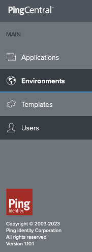
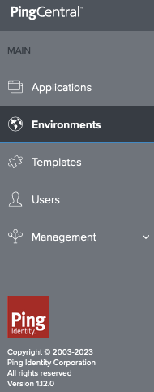

# Upgrading PingCentral

!!! warning "Example Only"
    This example is for demonstration purposes only. It is not intended to reflect the complexities of a full production environment and will need to be adapted accordingly.

## Caveats

### Kubernetes and Helm

   This document will focus on deployments in a Kubernetes environment using the **ping-devops** Helm chart. However, the concepts should apply to any containerized PingCentral deployment.

### This document will become outdated

   The examples referenced in this document point to a specific tag. This tag may not exist at the time of reading. To correct the issue, update the tag on your files appropriately.  This example uses versions **1.10** and **1.12**, but the process should be similar for other versions in the future.

### MySQL is used as the PingCentral Datastore

   A separate MySql container is deployed manually to provide a backing store for PingCentral. In a production environment, you would likely use a managed database service.

### The Ping-provided baseline Profile is used as a starting point for PingCentral

   The default baseline profile is used for this guide.  In a production environment, you would likely use a custom repository and profile.

## Overall Process

Steps:

1. Deploy the old (1.10) version of PingCentral with the baseline server profile
1. Create a test user in PingCentral and perform other validation steps
1. Copy the `pingcentral.jwk` file to your server profile
1. Deploy the new (1.12) PingCentral version with a custom server profile
1. Validate the upgrade

## Prerequisites

Assumptions and requirements:

* You have set up your DevOps environment and can run a test deployment of the products. For more information, see [Get Started](../get-started/introduction.md).
* This example was written using Docker Desktop with Kubernetes enabled on the Mac platform.  The version used was `4.23.0 (120376)`, which includes Docker Engine `v24.0.6` and Kubernetes `v1.27.2`.  The ingress-nginx controller version was `1.8.2`, deployed from Helm chart version `4.7.2`.

## Environment Preparation

### Clone the `getting-started` repository

1. Clone the `pingidentity-devops-getting-started` repository to your local `${PING_IDENTITY_DEVOPS_HOME}` directory.
    !!! note "pingctl utility"
        The `${PING_IDENTITY_DEVOPS_HOME}` environment variable was set by running `pingctl config`.

    ```sh
    cd "${PING_IDENTITY_DEVOPS_HOME}"
    git clone \
      https://github.com/pingidentity/pingidentity-devops-getting-started.git
    ```

### Prepare the environment with a namespace and ingress controller

1. Create a namespace for running the stack in your Kubernetes cluster.  

     ```sh
     # Create the namespace
     kubectl create ns pingcentral-upgrade
     # Set the kubectl context to the namespace
     kubectl config set-context --current --namespace=pingcentral-upgrade
     # Confirm
     kubectl config view --minify | grep namespace:
     ```

1. Deploy the ingress controller to Docker Desktop:

     ```sh
     helm upgrade --install ingress-nginx ingress-nginx \
     --repo https://kubernetes.github.io/ingress-nginx \
     --namespace ingress-nginx --create-namespace
     ```

1. Wait for the Nginx ingress to reach a healthy state by running the following command.  You can also observe the pod status using k9s or by running `kubectl get pods --namespace ingress-nginx`. You should see one controller pod running when the ingress controller is ready.  This command should exit after no more than 60 seconds or so, depending on the speed of your computer:

    ```sh
    kubectl wait --namespace ingress-nginx \
      --for=condition=ready pod \
      --selector=app.kubernetes.io/component=controller \
      --timeout=90s
    ```

1. Create a secret in the namespace you will be using to run the example (*upgrade*) using the `pingctl` utility. This secret will obtain an evaluation license based on your Ping DevOps username and key:

     ```sh
     pingctl k8s generate devops-secret | kubectl apply -f -
     ```

1. This example will use the Helm release name `demo` and DNS domain suffix `*pingdemo.example` for accessing applications.  Add the expected hostname to `/etc/hosts`:

    ```sh
    echo '127.0.0.1 demo-pingcentral.pingdemo.example' | sudo tee -a /etc/hosts > /dev/null
    ```

1. Navigate to your local directory where you cloned the repository (`"${PING_IDENTITY_DEVOPS_HOME}"/pingidentity-devops-getting-started/30-helm/`) directory and run the command shown here to deploy the MySQL pod using `kubectl`.  This deployment will be used as the backing store for PingCentral.

    ```sh
    kubectl apply -f pingcentral-external-mysql-db/mysql.yaml
    ```

### Fork or clone the Ping server profile repository

1. Fork the [pingidentity-server-profiles](https://github.com/pingidentity/pingidentity-server-profiles) repository to your GitHub account.  If you do not have a GitHub account, you can clone the repository instead.  For this guide, the repository will be forked to `test-server-profiles` which will be pulled locally to `${HOME}/projects/test-server-profiles`.

    ```sh
    cd "${HOME}/projects"
    git clone <account>/test-server-profiles.git ${HOME}/projects/
    ```

## Deploy the old version of PingCentral with the Ping baseline server profile

1. Install the initial version by running the command shown here.  In this example, the release `demo` forms the prefix for all objects created. The ingress is configured to use the **ping-local** domain:

    ```sh
    cd "${PING_IDENTITY_DEVOPS_HOME}"/pingidentity-devops-getting-started/30-helm/
    helm upgrade --install demo pingidentity/ping-devops -f pingcentral-upgrade/01-original.yaml
    ```

This command will take a few minutes to complete.  You can monitor the progress using `kubectl get pods` or `k9s`.

## Access the PingCentral Console

1. Login to the PingCentral Administrative Console using the credentials `administrator/2Federate`.  The URL is [https://demo-pingcentral.pingdemo.example](https://demo-pingcentral.pingdemo.example).

1. Select **Users** from the left navigation menu and click **Add User**. Create a user to be used to validate PingCentral after the upgrade (the user specifics and role do not matter for this example).

The left navigation panel should indicate version 1.10.0 at the bottom as shown here:
    

### Confirm Database Entries

Shell into the MySQL pod and confirm that the user you created is present in the database.  Also, verify the version of PingCentral in the `DATABASECHANGELOG` table.

```sh
kubectl exec -it mysql-0 -- bash
# Use the password from the mysql.yaml file (2Federate)
mysql -u root -p
use pingcentral;
# The user will be listed here
select * from users;
# The version will be listed here, with the last lines of the table showing the most recent entries 
# at version v1.10 and v1.11 (46 lines total at the time of this writing)
select * from DATABASECHANGELOG;
```

## Add the `pingcentral.jwk` file to your server profile

1. Copy the `pingcentral.jwk` file from the PingCentral pod.  This file will be used in the next step to configure the new PingCentral instance.  This example places the file in the repository directory from the fork created earlier.

    ```sh
    kubectl cp demo-pingcentral-6d4bb97c98-m7vwb:/opt/out/instance/conf/pingcentral.jwk ${HOME}/projects/test-server-profiles/baseline/pingcentral/external-mysql-db/instance/conf/pingcentral.jwk
    ```

1. Check to see that the `pingcentral.jwk` file has been updated in your server-profile and push these changes to your repository.

    ```sh
    cd "${HOME}/projects/test-server-profiles"
    git add .
    git commit -m "Added pingcentral.jwk file"
    git push
    ```

!!! note "Pod Name"
    The pod name from which you copy will vary.
!!! note "JWK Unique to PingCentral Instance"
    The `pingcentral.jwk` file is used to encrypt and decrypt the PingCentral configuration.  It is unique to each PingCentral instance and must be copied to the new server profile.  Otherwise, the new pod will fail to start.
!!! warning "Security Warning"
    Storing the `pingcentral.jwk` file in the server profile **is not recommended** for production environments.  In a production environment, you would likely use a managed key store service, vault, or other encrypted mechanism.

## Deploy the new version of PingCentral with a custom server profile

1. Update the `/pingidentity-devops-getting-started/30-helm/pingcentral-upgrade/02-upgraded.yaml` file to point to the repository and profile directory that contains the JWK file. This example uses the `test-server-profiles` repository, but you should use your own information.

```sh
helm upgrade --install demo pingidentity/ping-devops -f pingcentral-upgrade/02-upgraded.yaml
```

The new pod will spin up, and when it is healthy, the old pod will be terminated.  At this time, you should have an upgraded PingCentral instance.  Log in to the administrative console as before.  The user you created earlier should still exist, and the version information at the lower left should indicate version 1.12.0.  In addition, a new left navigation item (Management) will be present that was not there before:

   

Finally, a check of the `DATABASECHANGELOG` table in the MySQL pod should show the new version of PingCentral as the last few entries in that table (51 entries as of this writing).  These updated entries indicate the database migration was successful.

## Cleanup

After you have finished this demonstration, you can uninstall the Helm release and MySQL deployment, and delete the namespace:

```sh
helm uninstall demo
kubectl delete -f pingcentral-external-mysql-db/mysql.yaml
kubectl delete ns pingcentral-upgrade
```

Remove the entry from `/etc/hosts` if you do not plan to use the same hostname again:

```sh
sudo sed -i '' '/demo-pingcentral.pingdemo.example/d' /etc/hosts
```

You can also remove the `test-server-profiles` repository from your local machine and delete the forked repository from GitHub:

```sh
rm -rf "${HOME}/projects/test-server-profiles"
```
