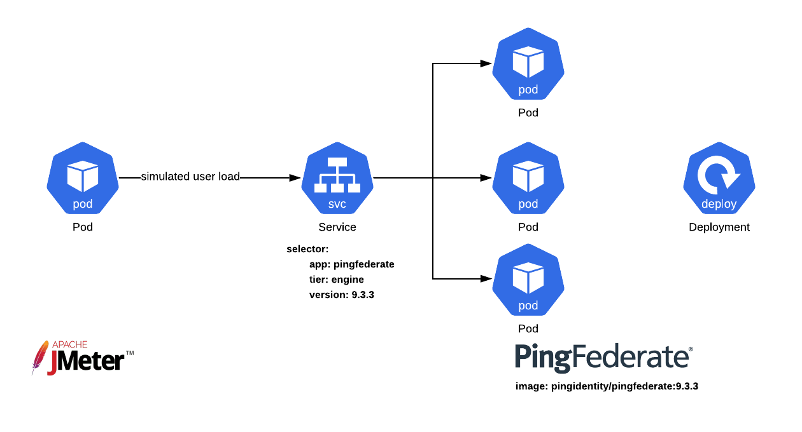

# Upgrading PingFederate

In a DevOps environment, upgrades can be simplified through automation, orchestration, and separation of concerns.

General Steps:

   - [Persistent Volume Upgrade](#persistent-volume-upgrade) of `/opt/out/instance/server/default/data` on pingfederate-admin
   - [Server Profile Upgrade](#server-profile-upgrade)
   - [Post Upgrade](#post-upgrade)

[Persistent Volume Upgrade](#persistent-volume-upgrade) will include steps helpful to both pieces. [Server Profile Upgrade](#server-profile-upgrade) will discuss extracting upgraded files.

## Caveats

1. **This Document Assumes Kubernetes and Helm**

   The terms in this document will focus on deployments in a Kubernetes Environment using the ping-devops Helm chart. However, the concepts should apply to any containerized PingFederate Deployment. 

1. **Upgrades from Traditional Deployment**
   
   It may be desirable to upgrade PingFederate along with migrating from a traditional environment. This is not recommended. Instead you should upgrade your current environment to the desired version of PingFederate and then [create a profile](./buildPingFederateProfile.md) that can be used in a containerized deployment.

1. **Persistent Volume on `/opt/out`**
   
   The suggested script should not be used if a persistent volume is attached to `/opt/out`. New software bits will not include special files built into the docker image. It is recommended to mount volumes on PingFederate Admin to `/opt/out/instance/server/default/data`. 
   <!--TODO: If you do have /opt/out mounted, instead of running the the example script,  -->

1. **Irrelevant Ingress**
   
   The values.yaml files mentioned in this document expects and nginx ingress controller with class `nginx-public`. It is not an issue if your environment doesn't have this, the created ingresses will not be used.

<!--TODO: flip. upgrade happens first. then discuss persistence and server profile.   -->

## Persistent Volume Upgrade

Steps needed in both Server-Profile upgrade and Persistent Volume upgrade include:

   1. Deploy your PingFederate version and server profile **as background process**
   1. Upgrade profile in container
      1. Backup the files in your profile.
      1. Download the PingFederate software bits for the new version. 
      1. Run upgrade utility
      1. diff to view the changes. (optional)
   1. Reconfigure any variablized components.
   1. Export changes to your profile

Here we will walk through an example upgrade.

!!! Info "This Process Requires Container Exec Access"
   Your orchestration user will need access to `kubectl exec -it <pod> -- sh` for multiple steps here. 

### Deploy Pingfederate as a Background Process

Deploy your PingFederate version and server profile as background process with Helm: 

!!! Info "Make sure you have a devops-secret"
   If you are using this example as is, you will need a [devops-secret](../get-started/devopsUserKey.md#for-kubernetes)

```
helm upgrade --install pf-upgrade pingidentity/ping-devops \
   --version 0.8.1 -f 20-kubernetes/15-pingfederate-upgrade/01-background.yaml
```

where values.yaml:

```yaml
--8<-- "20-kubernetes/15-pingfederate-upgrade/01-background.yaml"
```

The `args` section starts pingfederate as a background process and `tail -f /dev/null` as the foreground process.

### Upgrade Profile in Container

The steps for upgrading can be automated with a script. Example scripts are included at `20-kubernetes/15-pingfederate-upgrade/hooks`. 

To use the scripts, copy the folder your PingFederate container

```
kubectl cp 20-kubernetes/15-pingfederate-upgrade/hooks pf-upgrade-pingfederate-admin-0:/opt/staging
```

The pf-upgrade.sh script will: 
   - download the target PingFederate software bits
   - backup the current /opt/out folder to /opt/current_bak
   - run the upgrade utility 
   - overwrite /opt/out or /opt/out/instance/server/default/data with upgraded files
   - run diff between /opt/staging (server-profile location) and respective upgraded file. Diffs can be found in `/tmp/stagingDiffs`

Exec into the container and run the script.

```
kubectl exec -it pf-upgrade-pingfederate-admin-0 -- sh
cd /opt/staging/hooks
sh pf-upgrade.sh 10.3.4
```

At the conclusion of the script you will have an upgraded `/opt/out/instance/server/default/data` folder. 

## Server Profile Upgrade

If your profile is applied on each start of your container, you should keep your profile up to date with the product version you are deploying. 

After the previously run script, you can find upgraded profile files in `/opt/staging_new`
These files will be hard-coded and you should follow [Build a PingFederated Profile](./buildPingFederateProfile.md) as needed for templating.

Additionally, If you use the bulk-config data.json import it will not be found here. It should be imported via the standard process on the next container start.

## Post Upgrade
After upgrading your data folder and/or copying out your server profile files change your image version to the new target PingFederte version and run PingFederte as normal. 

```
helm upgrade --install pf-upgrade pingidentity/ping-devops --version 0.8.1 -f 20-kubernetes/15-pingfederate-upgrade/02-upgraded.yaml
```

```yaml
--8<-- "20-kubernetes/15-pingfederate-upgrade/02-upgraded.yaml"
```


<!-- ## Before you begin

You must:

* Complete [Get started](../get-started/getStarted.md) to set up your DevOps environment and run a test deployment of the products.
* Understand how to use our DevOps server profiles.
* Understand blue-green deployments in Kubernetes.

## About this task

You will:

* Set up and prepare your environment.
* Upgrade using a local profile.
* Stand up a blue-green deployment.

## Setting up and preparing your environment

The most important factor to a successful version upgrade is preparing an environment for success. This means using the DevOps process and a blue-green deployment. For a blue-green Kubernetes deployment, we simply update a selector on a service.

The DevOps process:

* **All software features migrate through environments**.

   You should have at least two environments (non-production and production). This gives you room to test everything before putting it into production.

* **Environments are nearly identical**.

   All deployments should be stringently validated before rolling into production. To be confident in your manual and automated tests, your environments need to be as close to identical as possible. In an ideal world, environments have dummy data, but function exactly the same.

   Your environments are nearly identical when the only thing that changes (related to configuration) between environments is URLs, endpoints, and variable values.

* **Containers in production are immutable**.

   Nobody is perfect, so do not trust manual changes directly in production. You should disable all admin access to production.

* **All configurations are maintained in source control**.

   If you can roll it out, you need to be able to roll it back, too!

Our example environment is set up with Apache JMeter generating load to a Kubernetes service (which routes load to downstream PingFederate containers). This Kubernetes service is essentially a load balancer that follows a round-robin strategy with keep-alive.



The key here is that the service is pointing to this deployment of PingFederate because of a selector defined on the service that matches a label on the PingFederate deployment. This is what makes the blue-green approach possible.

> A deployment in Kubernetes manages containers in pods, defining things, such as which containers to run, how many containers, the metadata labels, and the update strategy.

### Other Considerations

Using DevOps processes can mean that things like comfortable setup processes and admin UIs in production are sacrificed, but for most organizations, the resulting zero downtime for rollouts and rollbacks is easily worth it.

!!! note "zero downtime and loss-of-state"
    The terms "zero downtime" and "loss-of-state" are significantly different. Zero downtime is what this upgrade process achieves: at no point in time will users experience a `500 bad gateway` error. However, we are sacrificing state to achieve this. Because we are moving from one entire deployment to another, the new deployment does _cannot_ have access to runtime state in the previous deployment. For this reason, it's critical to externalize state as much as possible.

## Upgrading using a local profile

With your environment set up properly, you can do the product upgrade offline. Offline here means we'll pull the profile into a Docker container on our local workstation to upgrade it.

Before going into the actual steps for a profile upgrade. It's worth noting that if your profile is well-constructed, using the minimum number of files that are specific to the PingFederate configuration, you might be able to avoid this entire section.

For example, the upgrade for our baseline profile (https://github.com/pingidentity/pingidentity-server-profiles/tree/master/baseline) worked almost flawlessly from 9.3.3 to 10.0.0. In fact, the only file that required an update was adding a "Pairwise definition" to `./instance/server/default/conf/hivemodule.xml`.

This could be the case for you as well. If you want to try this, just use your PingFederate profile with the new version image tag, and watch the logs for errors.

Some details of the upgrade process might be different for you, based on your PingFederate profile. -->
<!--- TODO: link to PF profile --->
<!-- 
### Steps

1. Check out a PingFederate feature branch (such as, `pf-10.0.0`) off of the master of _your_ current version of PingFederate (9.3.3 in our example).

1. Spin up a PingFederate deployment based on this branch with the `/opt/out` volume mounted. For clarity, let's do this in Docker Compose and assume the mount looks something like this: `~/tmp/pf93/instance:/opt/out/instance`. When the container is healthy, stop the container.

1. Download the latest version of the PingFederate Server distribution .zip archive from the Ping Identity website. Extract the distribution .zip archive into `~/tmp/pf93`.

1. Go to the `~/tmp/pf93` directory, and run the PingFederate upgrade utility:

    ```shell
    ./upgrade.sh <pf_install_source> [-l <newPingFederateLicense>] [-c].
    ```

    > See [Upgrading PingFederate on Linux Systems](https://docs.pingidentity.com/bundle/pingfederate-100/page/ukh1564003034797.html) for more information.

1. CLean up the upgraded PingFederate profile, which has a lot of bloat from the upgrade, so that you can run `git diff` and see _only_ upgraded files.

    A good text editor (such as, Microsoft Visual Studio Code) with Git extensions is invaluable for this process.

    1. Copy over files from your new profile `~/tmp/pf93/instance` on top of your current profile. Avoid directly copying over and replacing `.subst` files.

    2. If you are using Visual Studio Code, you can `right-click` -> Select for compare on the old file and `right-click`>'Compare with selected' on the new file. This compares line-by-line diffs.

       If all you see is your variables, you can ignore the whole file.

1. After you test the upgrade, push your changes to Git.

## Standing up a blue-green deployment

Now that you have a new profile, you can stand up a new deployment that uses it and flip all of the traffic over to it.

1. Stand up a new deployment using the following:

    * The correct product image version.
    * The new profile.
    * A label on the deployment that distinguishes it from the prior deployment, such as `version: 10.0.0`.

2. When the deployment is healthy and ready to accept traffic, update the selector on the Kubernetes service.

   This routes all traffic to the new PingFederate deployment without downtime occurring. -->
