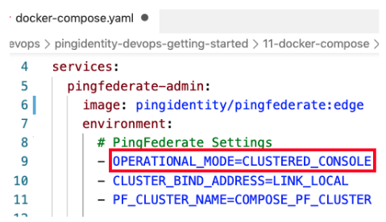

# Environment Substitution

In a typical environment, configuration is moved from server to server. Hostnames, endpoints, DNs, etc. need a way to be easily modified.

By removing literal values and replacing with environment variables,  configuration can be deployed in multiple environments with minimal change.

All configuration files can be parameterized by adding variables with the **${NAME}** syntax, and appending **.subst** file extension

## Passing Values to Containers

Within the environment section of your container definition, declare the variable and the value for this instance.

Values can be defined in many sources. In-line, configmaps, env_vars, etc.

## How it Works

1. Container starts
1. Pulls Server Profile from Git or mounted /opt/in volume
1. Finds all files with .subst extension
1. Replaces variables with provided environment values
1. Removes .subst extension
1. Starts product

