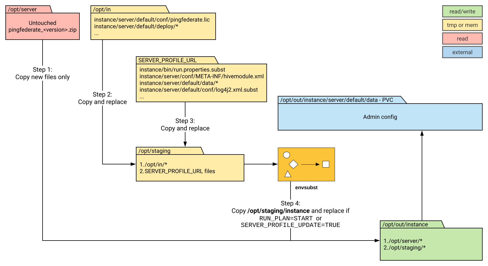
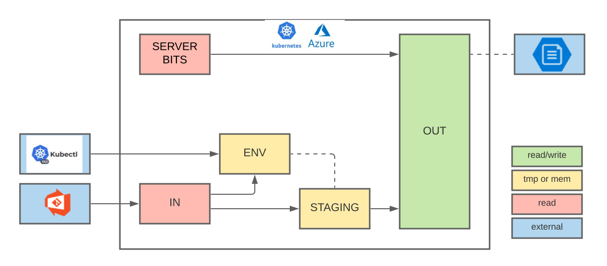

# Image/Container Components and Configuration

## Container data flows and running state

The diagram below shows the topology of a container with flows of data into the container and how it transitions to the eventual running state.

| Data Class        | Default Location  | Use | Description                                                                                                       |
| ----------------- | ----------------- | :-: | ----------------------------------------------------------------------------------------------------------------- |
| VAULT             |                   | ext | Secret information from external Vault (i.e. HashiCorp Vault).  Items like passwords, certificates, keys, etc...  |
| ORCH              |                   | ext | Environment variables from secrets, configmaps and/or env/envfile resources from orchestration (i.e. docker, k8s. |
| SERVER PROFILE    |                   | ext | Product server profile from either an external repository (i.e. git) or external volume (i.e. aws s3).            |
| SERVER BITS       | /opt/server       | ro  | Uncompressed copy of the product software.  Provided by image.                                                    |
| SECRETS           | /run/secrets      | ro  | Read Only secrets residing on non-persistent storage (i.e. /run/secrets).                                         |
| IN                | /opt/in           | ro  | Volume intended to receive all incoming server-profile information.                                               |
| ENV               | /opt/staging/.env | mem | Environment variable settings used by hooks and product to configure container.                                   |
| STAGING           | /opt/staging      | tmp | Temporary space used to prepare configuration and store variable settings before being moved to OUT               |
| OUT               | /opt/out          | rw  | Combo of product bits/configuration resulting in running container configuration.                                 |
| PERSISTENT VOLUME |                   | rw  | Persistent location of product bits/configuration in external storage (i.e. AWS EBS)                              |

Because of these many factors affecting how an image is deployed, the configuration options for use of the elements in the previous table can vary greatly, depending on factors such as:

* Deployment Environment - Kubernetes, Cloud Vendor, Local Docker
* CI/CD Tools - Kubectl, Helm, Kustomize, Terraform
* Source Maintenance - Git, Cloud Vendor Volumes
* Customer Environment - Development, Test, QA, Stage, Prod
* Security - Test/QA/Production Data, Secrets, Certificates, Secret Management Tools

## Examples
### File flowchart example

The following diagram shows how files can enter and flow through the container:

!!! note "There is a video that goes through the above image in more detail [here](https://videos.pingidentity.com/detail/videos/devops/video/6314748082112/ping-product-docker-image-exploration)."

### Production Example

The following diagram shows an example in a high-level production scenario in an Amazon Web Services (AWS) EKS environment, where:

* HashiCorp Vault is used to provide secrets to the container.
* Helm is used to create k8s resources and deploy them.
* AWS EBS volumes is used to persist the state of the container.

### Development Example

The following diagram shows an example in a high-level development scenario in an Azure AKS environment, where:

* No secrets management is used.
* Simple kubectl is used to deploy k8s resources.
* AWS EBS volumes is used to persist the state of the container.

## Customizing the Containers

You can customize our product containers by:

* [Customizing server profiles](../how-to/profiles.md)

    The server profiles supply configuration, data, and environment information to the product containers at startup. You can use our server profiles as-is or as a baseline for creating your own.

    You can find these profiles in [Baseline server profiles](https://github.com/pingidentity/pingidentity-server-profiles/tree/master/baseline) in our pingidentity-server-profiles repository.

* [Environment substitution](../how-to/profilesSubstitution.md)
  
    You can deploy configurations in multiple environments with minimal changes by removing literal values and replacing them with environment variables.

* [Using DevOps hooks](hooks.md)

    Hooks are shell scripts, generally specific to a product, that you can use to automate certain operations.

    You can find the hooks for our builds in the [Docker builds product directories](../docker-builds/README.md).

* [Using release tags](../docker-images/releaseTags.md)

    We use sets of tags for each released build image. These tags identify whether the image is a specific stable release, the latest stable release, or current (potentially unstable) builds. You can find the release tag information in [Docker images](../docker-images/releaseTags.md).

    You can try different tags in either the standalone startup scripts for the deployment examples or the YAML files for the orchestrated deployment examples.

* [Adding a message of the day (MOTD)](../how-to/addMOTD.md)

    You can use a `motd.json` file to add message of the day information for inclusion in the images.
