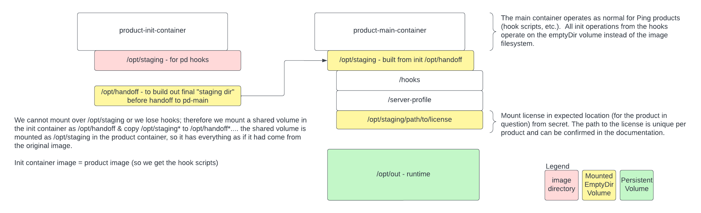

# Running product containers with a read-only filesystem

## Overview

In some environments, there is a requirement that the container filesystem be read-only.  Our product images are maturing to support this capability natively in the future.  In the meantime, this guide will explain the overall concepts and provide an example with PingDirectory.  The other product images will operate in a similar manner.  

!!! warning "Example only"
    This guide is intended to provide an example implementation of solving this problem; your situation might require a different approach.

!!! note "Ping image exploration"
    An excellent starting point for understanding what goes on with our containers as they are instantiated can be found in [this video](https://videos.pingidentity.com/detail/videos/devops/video/6314748082112/ping-product-docker-image-exploration).  It is highly recommended that you take the time to view it prior to working through this guide.

### High-level process

In Ping product containers, the layered approach of bringing the environment and configuration parameters into the container at launch requires merging of files from server profiles and other locations before the product is launched.  This process means that files are modified at runtime, and a read-only filesystem blocks this action.  The overall approach is to use **`emptyDir`** volumes to overlay the directories that need modification, allowing the hook scripts to run as normal, only against the volume rather than the container filesystem.  In order to get everything necessary for the scripts to be in place, an init container (using the same image as the product container) is launched and the files necessary are copied to the shared volume before starting the product container.

## File explanation

In the **30-helm/read-only-filesystem** folder of the [Getting Started repository](https://github.com/pingidentity/pingidentity-devops-getting-started) is a values file and kustomize directory.  First, we will explore the the `pd-values.yaml` file; inline comments explain what is going on:

<details>
  <summary>pd-values.yaml</summary>

```yaml
initContainers:
  pd-init:
    name: runtime-init
    # CHANGEMETAG TO VERSION NEEDED
    # Init container uses the same image as the product container and therefore versions much match
    image: pingidentity/pingdirectory:CHANGEMETAG
    env:
      # Override the startup command so the product is not launched in the init container
      - name: STARTUP_COMMAND
        value: "ls"
      # Use a name different from /opt/staging for holding the copied files from the product image into the emptyDir volume
      - name: STAGING_DIR
        value: "/opt/handoff"
      # Just in case there is a .env we will need
      - name: CONTAINER_ENV
        value: "/opt/handoff/.env"
      # Another flag for preventing the product from being launched
      - name: STARTUP_FOREGROUND_OPTS
        value: ""
    envFrom:
      # CHANGEMERELEASE TO MATCH HELM RELEASE NAME
      - configMapRef:
          name: CHANGEMERELEASE-global-env-vars
          optional: true
      - configMapRef:
          name: CHANGEMERELEASE-env-vars
          optional: true
      - configMapRef:
          name: CHANGEMERELEASE-pingdirectory-env-vars
      - secretRef:
          name: devops-secret
          optional: true
      - secretRef:
          name: CHANGEME-pingdirectory-git-secret
          optional: true
    volumeMounts:
      # emptyDir volume: /opt/staging will be copied from the init container to this volume
      # This volume will be mounted as /opt/staging in the product container
      - mountPath: /opt/handoff
        name: staging
        readOnly: false
      # The location for the license file varies by product
      # See https://devops.pingidentity.com/how-to/existingLicense/ for more information
      # The license file is required for the init container to operate
      - name: pingdirectory-license
        mountPath: "/opt/staging/pd.profile/server-root/pre-setup/PingDirectory.lic"
        subPath: PingDirectory.lic
      # Also an emptyDir
      - name: tmp
        mountPath: "/tmp"
        readOnly: false
      # Also an emptyDir
      - name: init-runtime
        mountPath: "/opt/out"
        readOnly: false
      # Mount the slightly modified versions of the bootstrap and start sequence scripts (see below)
      - mountPath: /opt/bootstrap.sh
        name: bootstrap
        readOnly: true
        subPath: bootstrap.sh
      - mountPath: /opt/staging/hooks/10-start-sequence.sh
        name: init-start
        readOnly: true
        subPath: 10-start-sequence.sh

volumes:
  # The 3 emptyDir volumes referenced above
  init-runtime:
    emptyDir: {}
  staging:
    emptyDir: {}
  tmp:
    emptyDir: {}
  # This secret is created from a license file
  pingdirectory-license:
    secret:
      secretName: pingdirectory-license
  # Make the modified bootstrap and start sequence scripts available as configMaps
  bootstrap:
    configMap:
      items:
      - key: bootstrap.sh
        path: bootstrap.sh
      name: bootstrap
  init-start:
    configMap:
      items:
      - key: 10-start-sequence.sh
        path: 10-start-sequence.sh
      name: init-start

configMaps:
  init-start:
    data:
      10-start-sequence.sh: |-
        #!/usr/bin/env sh
        echo "overwriting 10 hook"
        #!/usr/bin/env sh
        #
        # Ping Identity DevOps - Docker Build Hooks
        #
        # Called when it has been determined that this is the first time the container has
        # been run.
        #

        ##############################################################################
        ####### Prevent init container from starting the product normally.  ##########
        ####### These two lines are the only delta from the default script. ##########
        ##############################################################################
        if test ${STARTUP_FOREGROUND_OPTS} != "" ; then
          test "${VERBOSE}" = "true" && set -x

          # shellcheck source=./pingcommon.lib.sh
          . "${HOOKS_DIR}/pingcommon.lib.sh"

          echo "Initializing server for the first time"

          run_hook "17-check-license.sh"

          run_hook "18-setup-sequence.sh"
        fi
  bootstrap:
    data:
      bootstrap.sh: |-
        #!/usr/bin/env sh
        ######################################################################################################
        ####### Make a copy of everything under /opt/staging in the product image to /opt/handoff.  ##########
        ####### Primarily, this makes the hook scripts available in the emptyDir (writable) volume. ##########
        ####### This line is the only delta from the default script.                                ##########
        ######################################################################################################
        cp -r /opt/staging/* /opt/handoff
        test "${VERBOSE}" = "true" && set -x
        # shellcheck source=./staging/hooks/pingcommon.lib.sh
        . "${HOOKS_DIR}/pingcommon.lib.sh"

        _userID=$(id -u)
        _groupID=$(id -g)

        echo "### Bootstrap"
        if test "${_userID}" -eq 0; then
            echo_yellow "### Warning: running container as root user"
        else
            echo "### Using the default container user and group"

            _effectiveGroupName=$(awk 'BEGIN{FS=":"}$3~/^'"${_groupID}"'$/{print $1}' /etc/group)
            test -z "${_effectiveGroupName}" && _effectiveGroupName="undefined group"

            _effectiveUserName=$(awk 'BEGIN{FS=":"}$3~/^'"${_userID}"'$/{print $1}' /etc/passwd)
            test -z "${_effectiveUserName}" && _effectiveUserName="undefined user"

            echo "### Container user and group"
            echo "###     user : ${_effectiveUserName} (id: ${_userID})"
            echo "###     group: ${_effectiveGroupName} (id: ${_groupID})"
        fi

        # if the current process id is not 1, tini needs to register as sub-reaper
        if test $$ -ne 1; then
            _subReaper="-s"
        fi

        # shellcheck disable=SC2086,SC2048
        exec "${BASE}/tini" ${_subReaper} -- "${BASE}/entrypoint.sh" ${*}

pingdirectory:
  enabled: true
  envs:
    MUTE_LICENSE_VERIFICATION: "yes"
    ORCHESTRATION_TYPE: "NONE"
    VERBOSE: "true"
 # (Optional) Specify a particular tag by uncommenting these two lines and naming the tag to use.
 # Otherwise, you will get the latest from Docker Hub.
 # If a particular tag is used, be sure the init container tag matches above
 # image:
 #   tag: "2306"
  includeInitContainers:
  # Use the init container specification above at pod startup
    - pd-init
  # Share the volumes between the init container and the product container
  includeVolumes:
    - staging
    - tmp
    - pingdirectory-license
    - bootstrap
    - init-start
    - init-runtime
  volumeMounts:
    # The emptyDir mounted at /opt/handoff in the init container is mounted to /opt/staging here
    # Hook scripts and product startup will operate as with a read/write filesystem
    - mountPath: /opt/staging
      name: staging
      readOnly: false
    - name: pingdirectory-license
      mountPath: "/opt/staging/pd.profile/server-root/pre-setup/PingDirectory.lic"
      subPath: PingDirectory.lic
    - name: tmp
      mountPath: "/tmp"
      readOnly: false
```

</details>

In the **30-helm/read-only-filesystem/kustomize** subdirectory is a kustomize script and definition file.

The script simply runs kustomize:
```bash
#!/bin/bash

cat <&0 > kustomize/all.yaml

kustomize build kustomize && rm kustomize/all.yaml
```

The `kustomization.yaml` file makes the injected scripts executable and sets the **securityContext** for the containers to read-only:

```yaml
resources:
  - all.yaml

patches:
  - target:
      group: apps
      version: v1
      kind: StatefulSet
    patch: |-
      - op: add
        path: /spec/template/spec/volumes/3/configMap/defaultMode
        value: 0777
      - op: add
        path: /spec/template/spec/volumes/4/configMap/defaultMode
        value: 0777
      - op: add
        path: /spec/template/spec/containers/0/securityContext
        value:
          readOnlyRootFilesystem: true
      - op: add
        path: /spec/template/spec/initContainers/0/securityContext
        value:
          readOnlyRootFilesystem: true
```

## Process

To use the example files to deploy PingDirectory with a readonly root filesystem, follow the steps here:

1.  Generate a license file and create a secret.  If you have an existing license file, you can use it here:

    ```bash
    # Generate the license file
    pingctl license pingdirectory 9.2 > PingDirectory.lic

    # Create the secret to match the name in the values file:
    kubectl create secret generic pingdirectory-license --from-file=./PingDirectory.lic
    ```

1.  Update the **`30-helm/read-only-filesystem/pd-values.yaml`** file with the appropriate image tag and release name to be used with Helm.  Afterward, use Helm to deploy the release:

    ```bash
    # For this example, the release name of 'rofs' is used
    cd 30-helm/read-only-filesystem
    helm upgrade --install rofs pingidentity/ping-devops -f './pd-values.yaml' \
          --post-renderer kustomize/kustomize
    ```

## Diagram

This image provides an overview of what happens.  It is best viewed in a separate tab:



!!! note "/etc/motd"
    One issue we encountered is that the **`/etc/motd`** file can be modified at startup by hook scripts, but /etc/ is a read-only filesystem.  We are exploring ways to address this in some way, but at this time, it appears one possible solution is to treat `/etc/` in the same manner as /opt/staging (copying to an emptyDir) if the `motd` file is to be updated.  However, `/etc` has many more files and directories and such a solution is not practical.  Baking it into a custom image is another possibility.

