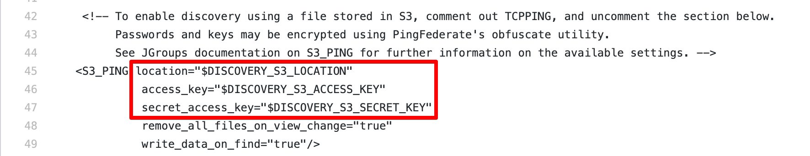
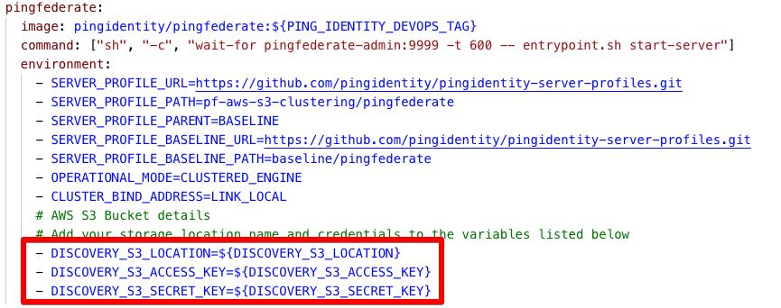
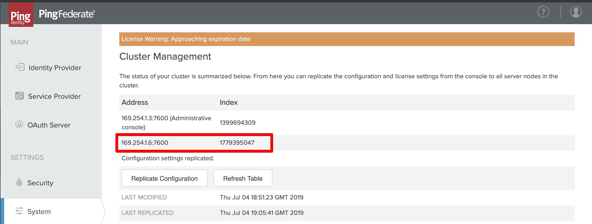
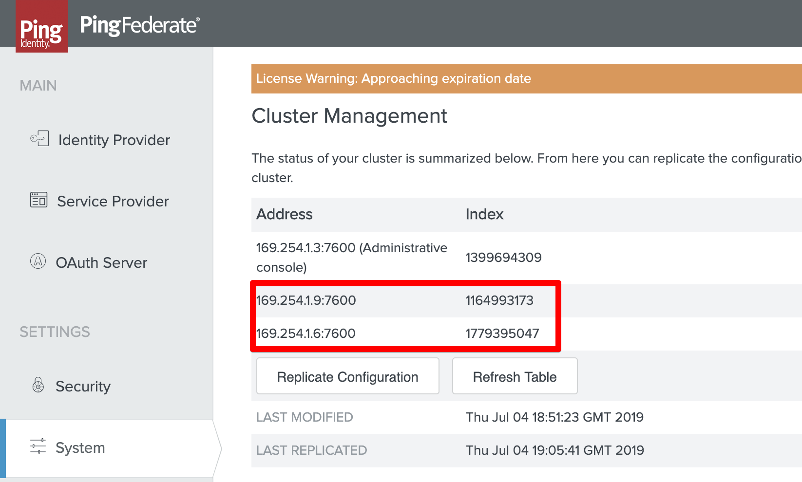

# PingFederate clustering using Docker Swarm and AWS S3

In this example, we’ll stand up a PingFederate cluster containing an administration console and multiple engines nodes using Docker Swarm and an Amazon Web Services (AWS) S3 bucket for node discovery.

This is the YAML file you'll be using for this example: [pingfederate_clustering_with_S3_discovery.yaml](https://raw.githubusercontent.com/pingidentity/pingidentity-devops-getting-started/master/12-docker-swarm/pingfederate-clustering-with-s3/pingfederate_clustering_with_S3_discovery.yaml)

## Prerequisites

* You've started Docker Swarm at some point before deploying the stack by running: `docker swarm init`. You only need to run `docker swarm init` once.
* You've already been through [Getting Started](getStarted.md) to set up your DevOps environment and run a test deployment of the products.

## What you'll do

* If you don't already have an AWS S3 bucket to use, create an AWS S3 bucket and assign permissions.
* Add an AWS user, if you don't already have one you want to use. You'll need the user name, key and secret.
* Configure the [`pingfederate_clustering_with_S3_discovery.yaml`](../12-docker-swarm/pingfederate-clustering-with-s3) file for your AWS S3 account.
* Launch the PingFederate cluster.
* Scale out the cluster.

## Create an AWS S3 bucket and assign permissions

1. Log into your AWS console and go to the S3 service.
2. Click `+ Create bucket`.
3. Give your bucket a name and select a region, then click `Next`.
4. For this example, we’ll skip the `Configure options` screen and go straight to `Set Permissions`.
5. Select the option to `Block all public access`. In a subsequent step, we’ll create an API key and secret to access the bucket. Click `Next`.
6. On the `Review` screen, click `Create Bucket`.

## Add an AWS user

1. In the AWS console, go to the `IAM service`.
2. Click the `Create individual IAM users` dropdown list and select `Manage Users`.
3. Click `Add User`.
4. Give your user a name, then select `Programmatic access` for the `Access type`.
5. Click `Next: Permissions`
6. Select the `Attach existing policies directly` tab, then filter by `AmazonS3FullAccess`.
7. Select the `AmazonS3FullAccess` policy from the list, then click `Next: Tags`.
8. Click `Next: Review`.
9. Review the user details, then click `Create User`.
10. When the user is created, you'll see the `Access Key ID` and have access to view the secret. 
    > You cannot retrieve the secret later, so it's a good idea to download the CSV file provided.
11. Keep the key and secret. They'll be needed in subsequent steps.

## Configure the YAML file

1. Open the [`pingfederate_clustering_with_S3_discovery.yaml`](../12-docker-swarm/pingfederate-clustering-with-s3) file in the editor of your choice.
   
   Notice that the PingFederate services each use two server profiles. This layered profile approach allows you to layer multiple server profiles to avoid configuring each use case separately. See [Using layered server profiles](profilesLayered.md) for more information.
   
   The `baseline/pingfederate` server profile acts as the foundation, with the `pf-aws-s3-clustering/pingfederate` server profile as the top layer. This layer contains only the `tcp.xml.subst` file that is used to configure clustering.

   Keep the `pingfederate_clustering_with_S3_discovery.yaml` open in your editor.

2. Go to the [tcp.xml.subst](../../pingidentity-server-profiles/pf-aws-s3-clustering/pingfederate/instance/server/default/conf/tcp.xml.subst) file and scroll down to about line 45:

   

   Notice the three variables for location: the S3 bucket name, key and secret.

3. In the `pingfederate_clustering_with_S3_discovery.yaml` file currently open in your editor, scroll down and update the values for `DISCOVERY_S3_LOCATION`, `DISCOVERY_S3_ACCESS_KEY`, and `DISCOVERY_S3_SECRET_KEY` in both of the PingFederate services (Admin and Engine) with the values from your AWS S3 account:
   
   

4. Save the `pingfederate_clustering_with_S3_discovery.yaml` file.

## Launch the PingFederate cluster

1. Go to your local Docker Swarm example directory: `${HOME}/projects/devops/pingidentity-devops-getting-started/12-docker-swarm`.
2. Start the swarm services: 

    `$ docker service init`

3. Deploy the cluster: 

    `$ ./swarm-start.sh pingfederate_clustering_with_S3_discovery.yaml`

4. When all services are running and healthy, open the PingFederate console:

    `https://localhost:9999/pingfederate/app`

5. Select `System --> Cluster Management`. Your PingFederate Engine node should be attached to the admin console:

    

## Scale out the cluster

1. Display the running services in a terminal: 

    `$ docker service list`

2. Scale the number of Engine nodes to 2: 

    `$ docker service scale pingfederate_clustering_with_S3_discovery_pingfederate=2`

3. After a minute or two, refresh your PingFederate browser window. The second Engine node should now be attached:

    
