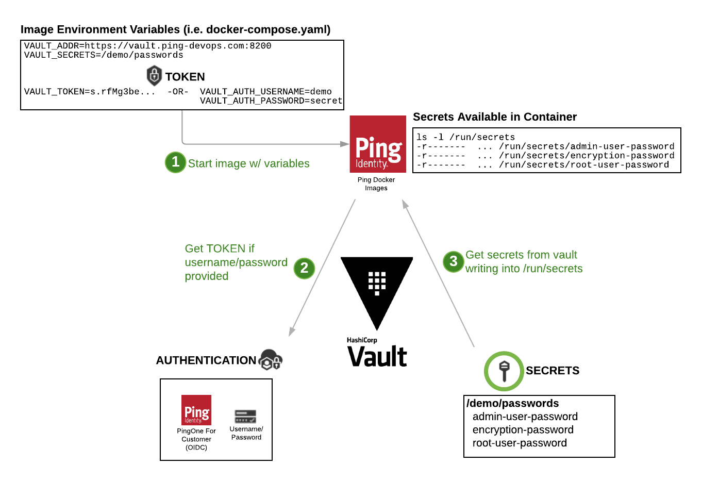

# Using Hashicorp Vault with Images

This provides details for using Hashicorp Vault and secrets with Ping Identity DevOps Images.

## What you'll do

The examples below will explain and show examples of:
- Using HashiCorp Vault Secrets in native PingIdentity DevOps Images
- Using HashiCorp Vault Injector in kubernetes deployments

## Prerequisites

- You've already been through [Get started](getStarted.md) to set up your DevOps environment and run a test deployment of the products.
- Have a running Hashicorp Vault instance.  Refer to [Deploy Hashicorp Vault](deployVault.md) for information on deploying a vault if you need one.


## Using HashiCorp Vault Secrets in native PingIdentity DevOps Images

Vault secrets can also be used in native PingIdentity DevOps Images regardless of the environment they are deployed in (i.e. kubernetes, docker, docker-compose).  In these cases, there is no injector agent required.

The image below depicts the components and steps for pulling secrets into a container at start-up.



The following variables can be used to deploy images that will pull secrets from the Vault.

| Variable            | Example     | Description
| ------------------- | ----------- | ---------------------------------
| SECRETS_DIR         | /run/secrets  | Location where secrets will be stored by default.  Please see section below on using a `tmpfs` mounted filesystem to store secrets in a memory location.  The default location is `/run/secrets`
| VAULT_TYPE          | hashicorp   | Type of vault used. Currently supporting hashicorp.
| VAULT_ADDR          | https://vault.example.com:8200 | URL for the vault with secrets
| VAULT_TOKEN         | s.gvC3vd5aFz......JovV0b0A     | Active token used to authticate/authorize container to vault.  Optional if VAULT_AUTH_USERNAME/VAULT_AUTH_PASSWORD are provided.
| VAULT_AUTH_USERNAME | demo                           | Username of internal vault identity. Optional if VAULT_TOKEN is provided.
| VAULT_AUTH_PASSWORD | 2FederateM0re                  | Password of internal vault identity. Optional if VAULT_TOKEN is provided.
| VAULT_SECRETS       | /pingfederate/encryption-keys  | A list of secrets to pull into the container.  Must be the full secret path used in vault.

Below is an example of how these would be used in an docker-compose.yaml file.  Note that this example provides 2 secrets as denoted by the VAULT_SECRETS setting.

``` yaml
services:
  pingfederate:
    image: pingidentity/pingfederate:edge
    environment:
      ...
      ################################################
      # Vault Info
      ################################################
      - VAULT_TYPE=hashicorp
      - VAULT_ADDR=https://vault.ping-devops.com:8200
      - VAULT_AUTH_USERNAME=demo
      - VAULT_AUTH_PASSWORD=2FederateM0re
      - VAULT_SECRETS=/demo/passwords
                      /demo/getting-started/pingfederated/pf-keys

```

Assuming the following secret definition for each secret:

```
$ vault kv get secret/demo/getting-started/pingfederated/pf-keys

====== Data ======
Key          Value
---          -----
pf.jwk       {"keys":[{"kty":"oct","kid":"....yy5yZ","k":"...YBi1z..."}]}

$ vault kv get secret/demo/passwords

========== Data ==========
Key                 Value
---                 -----
admin-user-password 2FederateM0re
encryption-password 2FederateM0re
root-user-password  2FederateM0re
```

This would result in the following files:

```
  /run/secrets/pf.jwk
  /run/secrets/admin-user-password
  /run/secrets/encryption-password
  /run/secrets/root-user-password
```

## Special secret metadata

By default, all the keys in a secret translate to a file in SECRETS_DIR that is created with the value representing the file contents.  This example shows how the fils would be created for each of the secrets, if the SECRETS_DIR is the default `/run/secrets`

```
Secret: /demo/passwords

  KEY                 VALUE            File Created
  ---                 -----            ------------
  admin-user-password 2FederateMore    /run/secrets/admin-user-password
  encryption-password 2FederateMore    /run/secrets/encryption-password
  root-user-password  2FederateMore    /run/secrets/admin-user-password
```

However, there are special use cases that the Ping Identity DevOps images will support depending on the secret name and special keys (i.e. meta information) found in the secret.
- Specifying a path that should copy/link from
- Specifying special permission to assign the secret (default: `0400`)
- Specifying that the key contents are base64 encoded, to be decoded when created into container

Secret keys that start with an underscore (_) indicate metadata to be used in the creation of those secrets in the container.  The following table provides the *optional* metadata details that can be used in a secret.

| Metadata            | Options        | Description
| ------------------- | -------------- | ---------------------------------
| _link               | {path}         | Creates link(s) from this path location to file(s). If there is a file in this location, it will be replaced by the symbolic link(s).  This is optional, and default is no link created.
| _permission         | {unix chmod mode} | Sets permission on created file(s). This is optional, and default is `0400`.


### Creating symbolic link to the secret from a different location
There are situations, when an application **REQUIRES** a file to be in a specific loation that you may deem a secret.  Instead of placing the secret file and compromising security of having it persisted on storage, a symbolic link can be created linking to the actual `/run/secrets` location.

If the secret has a key/value of the name `_link=/path`, then a link from that path/{key} to the secret location would be created.

The following example makes the PingFedereate pf.jwk file available to PingFederate by creating a link from the required location `/opt/out/instance/server/default/data` -> `/run/secrets/pf.jwk`
```
Secret: /demo/getting-started/pingfederated/pf-keys
 _link: /opt/out/instance/server/default/data

  KEY         VALUE            File Created
  ---         -----            ------------
  pf.jwk      {"keys"...}      /var/secrets/pf.jwk

with link:
    /opt/out/instance/server/default/data/pf.jwk --> /run/secrets/pf.jwk
```

## Special secret data formats
Often, there are secrets that may be of a binary format (i.e. certificates).
Special key name suffixes can be used to perform certain processing on the keys when the file is craeted.  The following table provides examples of how keys with special suffixes.

| Key Suffix          | Description
| ------------------- | ---------------------------------
| .b64 or .base64     | Specifies that the value is base64 encoded and the resulting file should be decoded when written, without the suffix.

Example: In the following example, there is a message that is base64 encoded and stored in the vault as secret `/demo/b64-demo` and key `hello.b64`

```
Secret: /demo/b64-demo

  KEY         VALUE
  ---         -----
  hello.b64   SGVsbG8gV29ybGQhCg==
```

would result in the following file:

```
/run/secrets/hello
  CONTENTS
  --------
  Hello World!
```

## Providing a tmpfs shared memory volume for secrets in docker-compose

It is best practice to place secrets in a volume that won't be persisted to storage with the possibility that it might be improperly accessed at any point in the future (i.e. backups, environment variables).  Options include locations like `/tmp` or as provided in the docker-compose.yal example below a `tmpfs` volume mount.

This docker-compose.yaml example will create a `tmpfs` type volume and size it to `32m` and mount it to a path of `/run/secrets`.

>Note: Requires docker-compose version 2.4 or later, dut tohe options provided to the tmpfs volumes definition.

``` yaml
version: "2.4"

services:
  pingfederate:
    image: pingidentity/pingfederate:edge
    environment:
    ...
    tmpfs: /run/secrets

      ---- or -----

    volumes:
      - type: tmpfs
        target: /run/secrets
        tmpfs:
          size: 32m
```

This will create a `/run/secrets` volume under tmpfs:

```
> df -k /run/secrets
Filesystem           1K-blocks      Used Available Use% Mounted on
tmpfs                    16384         0     16384   0% /run/secrets
```

## Using HashiCorp Vault Injector in kubernetes deployments

If the HashiCorp Vault Injector Agent is installed, annotations can be added to the `.yaml` file of a Pod, Deployment, StatefulSet resource to pull in the secrets.  The snippet below provides an example set of annotations (placed in to the metadata of the container) to pull in a `pf.jwk` secret into a container.

> Note: This was crated using `ping-devops vault create-annotations pingfederate/encryption-keys` tool.

``` yaml
  annotations:
    #----------------------------------------------------
    # Annotation secretes prepared for hashicorp vault secrets
    # for use in Deployment, StatefulSet, Pod resources.
    #
    # https://www.vaultproject.io/docs/platform/k8s/injector/annotations
    #
    vault.hashicorp.com/agent-pre-populate-only: true
    vault.hashicorp.com/agent-inject: true
    vault.hashicorp.com/role: k8s-default
    vault.hashicorp.com/log-level: info
    vault.hashicorp.com/preserve-secret-case: true
    vault.hashicorp.com/secret-volume-path: /run/secrets
    #------------------------------------------------
    #
    #------------ key: pf.jwk
    vault.hashicorp.com/agent-inject-secret-pf.jwk: "secret/pingfederate/encryption-keys/"
    vault.hashicorp.com/agent-inject-template-pf.jwk: |
      {{ with secret "secret/pingfederate/encryption-keys/" -}}
      {{ .Data.data.pf.jwk }}
      {{- end }}
    #------------------------------------------------
```

Upon starting containers related to this resource, the value for secret `secret/pingfederate/encryption-keys` key of `pf.jwk` will be pulled into the container.  By default, the secret would be placed in to a tmpfs volume `/run/secrets`.

```
  /run/secrets/pf.jwk
```

>Note: The annotaion `vault.hashicorp.com/secret-volume-path: /run/secrets` sets the path for all secrets created.  If a secret should be put into a different location by default, the following annotation can be added providng that location.

>IMPORTANT: Placing the secret in a non-tmpfs space can compromize the security of that secret due to unintended use (i.e. backups).

``` yaml
        vault.hashicorp.com/agent-inject-secret-pf.jwk: "secret/pingfederate/encryption-keys/"
        vault.hashicorp.com/secret-volume-path-pf.jwk: /opt/out/instance/server/default/data
```

resulting in the location

```
  /opt/out/instance/server/default/data/pf.jwk
```

