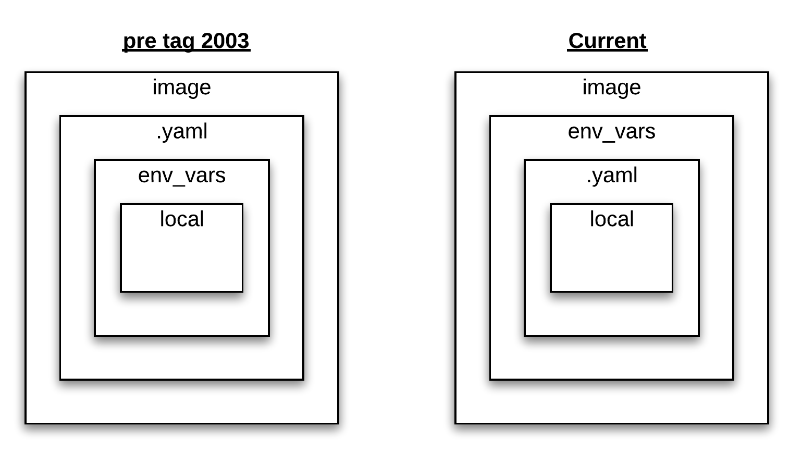
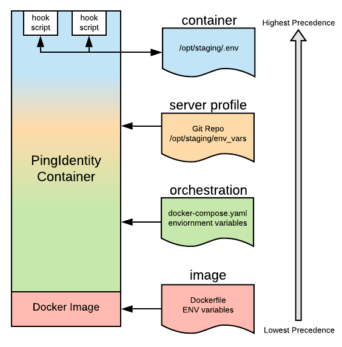

# Variable Scoping

## Image scope 
Defined with default values in the Docker Image (i.e Dockerfiles).  They are often set as defaults, allowing narrower scopes to override them.

* To see default ENV variables available with any docker image, run:

        docker run pingidentity/pingdirectory:edge env | sort

* Documenation can be found on the DevOps Gitbook.

  * Example pingdirectory: https://pingidentity-devops.gitbook.io/devops/dockerimagesref/pingdirectory

## .yaml scope
Defined at the orchestration layer.  Typically these represent environment variables passed with docker commands, docker-compose yamls and kubernetes config refs. 

* Example with docker run (using --env)

        docker run --env SCOPE=env \
               pingidentity/pingdirectory:edge env | sort
      
* Example with docker run (using --env-file)

        echo "SCOPE=env-file"  > /tmp/scope.properties

        docker run --env-file /tmp/scope.properties \
               pingidentity/pingdirectory:edge env | sort
   
* Example with docker-compose (docker-compose.yaml excerpt)

        environment:
          - SCOPE=compose
            env_file:
          - /tmp/scope.properties

* Example with kubernetes (.yaml excerpt)

        env:
          - name: SCOPE
            value: kubernetes

* Example with kubernetes  (config or secret refs .yaml excepts)

        - envFrom:
          - configMapRef:
            name: kubernetes-variables
          - secretRef:
            name: kubernetes-secret

## Server Profile scope 
A property file provided by the server-profile repo.  NOT RECOMMENDED as this overrides all Image/Orchestration variables

    - Exmaple env_vars file

      SCOPE=env_vars

## Container scope 
Any variables defined in the hook scripts.  Variables that need to be passed to other hook scripts can append to ${CONTAINER_ENV}, 
(defined as /opt/staging/.env).  This file will be sourced for every hook.

# Example Scoping

